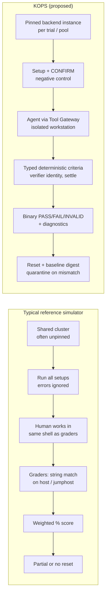

# Cross-Repository Architecture Comparison (B)

This comparison is based on code-path reading of the five P0 repositories, plus the three P1 repositories where relevant. The per-repo detail, with file and line evidence, is in [`references/`](references/).

**All eight systems are human exam simulators.** None has an agent interface, trace capture, or a model-independent evaluation contract. KOPS therefore borrows *mechanisms*, not an architecture.

---

## 1. Lifecycle comparison

## 2. Dimension-by-dimension matrix

| Dimension | grindxhq-cka | k16s | ck-x | ckad-2026 | ckad-dojo | Best observed | KOPS decision |
|---|---|---|---|---|---|---|---|
| **Task representation** | One YAML: task + setup[] + validation[] + solution | YAML metadata + `setup.sh` + `validate.sh` | JSON assessment + per-step scripts | Folder quartet (MD/sh/sh/MD) | bash `exam.conf` + MD + bash scoring | grindxhq (single declarative file, hidden fields) | `scenario.yaml` + `task.md` + `criteria.yaml` + hidden `reference/`, schema-validated ([F](scenario-schema.md)) |
| **Machine-readable competency mapping** | Free-text category (29 spellings) | none | `concepts[]` free text | none | CNCF domain column in MD | dojo (domain column) | Enumerated competency ids per profile, schema-enforced |
| **Task discovery** | Embedded FS, sorted | Dir glob | labs.json registry | Folder names | `exams/*/exam.conf` | grindxhq (deterministic, embedded) | Registry + content digest + frozen release manifest |
| **Cluster engine** | kind (unpinned) | kubeadm on host + LXC workers | k3d/k3s in DinD (unpinned) | BYO | BYO | k16s (real kubeadm, pinned 1.33) | kind pinned by digest (A/B1); Incus VMs (B2) |
| **Topology / multi-cluster** | 1–4 clusters, per-question context | 1 cluster, 1+N nodes | 1 cluster | 1 | 1 | grindxhq | Per-scenario topology. Multi-cluster as a future feature |
| **Node / system access** | ssh bastion → kind nodes (runtime apt) | ssh → LXC workers; control plane is the host | none | none | host shell | k16s (real systemd) / grindxhq (control plane in container) | B1: ssh into kind nodes (baked sshd), control plane in a container. B2: VMs |
| **Setup** | Host `sh -c`, all at start, warnings only | Per-question on click, root, 60 s | Sequential loop, exit codes ignored | `setup.sh` per question | Manifests + templates + post-setup hook | dojo (declarative seed + imperative hook) | `setup.sh` (verifier-admin) + **mandatory confirm** |
| **Fault injection** | Setup commands; `docker exec` on nodes | `sed` on manifests; `incus exec systemctl` | Broken manifests | Broken manifests | Seeds + post-setup | k16s (real component faults) | Typed fault inventory (`initial_state.faults`) + setup; node faults inside a disposable node |
| **Negative control** | ❌ | ❌ | ❌ | ❌ | ❌ | — | ✅ `setup.confirm.must_fail` (required) |
| **Verification contract** | cmd + matcher (exact/contains/regex/not-contains) | exit code | exit code (stdout ignored) | printed score | `score/max` + keyword-parsed DETAILS | CK-X (simple exit-code per step) | Typed criteria, tri-state pass/fail/error, JSON evidence ([criteria schema](../schemas/criteria.schema.json)) |
| **Where graders run** | Host (≠ user's bastion) | Host as root (= control plane) | Jumphost (= user's shell) | User's shell | User's host | k16s (`incus exec` separate channel) | Runner, as verifier identity; the agent workstation cannot see or reach it |
| **Behavioural checks** | Rare | None for netpol | ~21 of 395 scripts | None | Rare | ckad-exams (P1: positive+negative probes) | First-class `net.http/tcp/dns` with positive controls |
| **Timing / flakiness handling** | 5 s, no polling | 30 s timeout < validator polling | No timeouts | None | None | — | Declared `settle` + `stability` windows. Self-test ×3 flake check |
| **Scoring** | All-or-nothing per question × weight; 66% | Σ weights passed | Per-step weights; % | Per-criterion points | Weighted criteria; 66% | — | **Binary PASS per scenario.** Criteria are diagnostic only. No weights in the primary metric |
| **Solution storage / exposure** | Inline, returned by API | Near-solutions in visible hints | `answers.md` via open API | `ANSWER.md` beside task | `solutions.md` via UI | — | Hidden `reference/`, never mounted or served. Run through the gateway in self-test |
| **Self-test (solution ⇒ pass)** | ✅ E2E runner (not in CI; runs on host) | ❌ (1 lint) | ❌ | ❌ | ❌ | grindxhq | `kops selftest`: negative control, null agent, negative solutions, oracle through gateway, ×3, reset digest |
| **Reset** | Denylist sweep | none; rebuild | Cluster delete per exam | none | Destructive pattern cleanup | ck-x (whole-cluster recreate) | Per-trial destroy or snapshot, or namespace-delete, **plus baseline digest verification** |
| **Version pinning / offline** | ❌ | Partly (k8s pinned; CRDs and helm online) | ❌ | ❌ | ❌ | k16s | Everything pinned by digest. Offline at trial time |
| **Capability-aware scoring** | — | ✅ `requires: heavy` removes tasks from the denominator | — | — | — | k16s | `backend.class` + `features`. Denominators reported per backend class |
| **Automation / CI** | vet + build | 1 Go test | none | none | lint + structural tests + pytest | ckad-dojo (CI hygiene) | Schema lint + contamination scan + self-test in CI |
| **Observability of the candidate** | none | none | none | none | none | — | Tool-call trace + API audit log attribution + node journals |

## 3. Cross-cutting findings

1. **Self-validation is the most important missing piece.** Only grindxhq has an E2E self-test, and it lacks a negative control. The audit found vacuous validators in grindxhq (s5-11, s2-15) and always-pass verifiers in cka-hand-on-lab (arc-004…007), which a negative control would have caught. It also found a validator in ckad-exams that applies its own reference solution. KOPS makes the self-test a hard gate (runtime-architecture.md §6).
2. **Grader/candidate separation is usually violated.**
   - CK-X exposes grader filenames and runs graders where the user works.
   - ckad-exams and ckad-2026 keep answers beside tasks.
   - grindxhq grades a different filesystem from the one the user edits.

   For an AI-agent benchmark this is fatal: an agent *will* read `/tmp/exam-assets/scripts/validation/`. KOPS isolates the workstation and gives the verifier its own identity.
3. **"Verified" usually means "spec fields match".** NetworkPolicy, Ingress, Gateway and HPA are graded structurally almost everywhere. For an agent benchmark, spec-only checks reward *plausible YAML* over *working systems*, which is exactly the failure mode we want to measure. KOPS uses behavioural invariants wherever they are deterministic.
4. **System-level fidelity and resettability were never achieved together.**
   - K16S gets real systemd and kubelet but mutates the host control plane.
   - grindxhq gets a disposable control plane (kind) but never faults systemd.
   - CK-X has no node access at all.

   KOPS B1 (`kind-node`) combines both; B2 covers what needs a kernel.
5. **Partial-credit scoring is universal in the references.** KOPS keeps criterion-level signals for diagnosis but makes **scenario PASS/FAIL** the primary metric, as the frozen KOPS principles require. That avoids the reference pattern where a 66% "pass" hides broken required behaviour.
6. **Provenance was nowhere recorded,** and in two repositories it is actively problematic. KOPS makes provenance a schema-level requirement.

## 4. What KOPS takes from each P0 repository (summary)

| Repo | Adopt (reimplemented) | Reject |
|---|---|---|
| grindxhq-cka | E2E self-test loop; declarative checks; hidden fields; bastion + ssh on kind; kubeconfig URL rewrite for in-network clients; cluster health → reuse/recreate state machine | Host-side grading; shared kubeconfig `use-context`; denylist reset; unpinned versions; runtime apt/curl |
| k16s | Capability tags + denominator exclusion; lint tying capabilities to scripts; LXC fidelity checklist (as requirements for B1/B2); separate grader channel; per-check failure reasons | Host control plane; no per-task reset; privileged LXC as isolation; validator timeouts shorter than polling; online setup |
| ck-x | Exit-code step graders (as tri-state criteria); explicit trial state machine; re-evaluation because graders are read-only; per-lab worker count | Graders visible to the candidate; swallowed setup errors; no exec timeouts; telemetry; k3s for CKA fidelity |
| ckad-2026 | Namespace-per-task isolation; four-part unit | Everything textual; racy status checks; no reset |
| ckad-dojo | Manifest listing owned resources (→ owner labels); seed + post-setup fault hook; read-only verifiers; domain tags + coverage matrix; CI hygiene | Everything textual, **including git history**; keyword-heuristic result parsing; positional matching; destructive cleanup |
