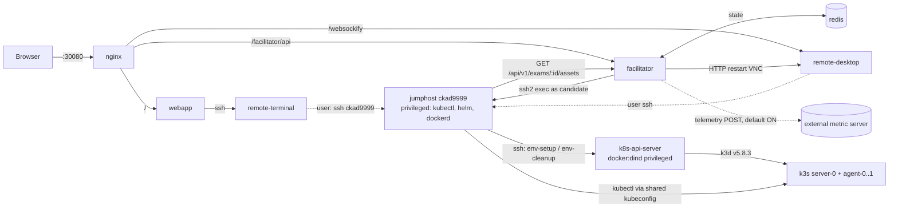
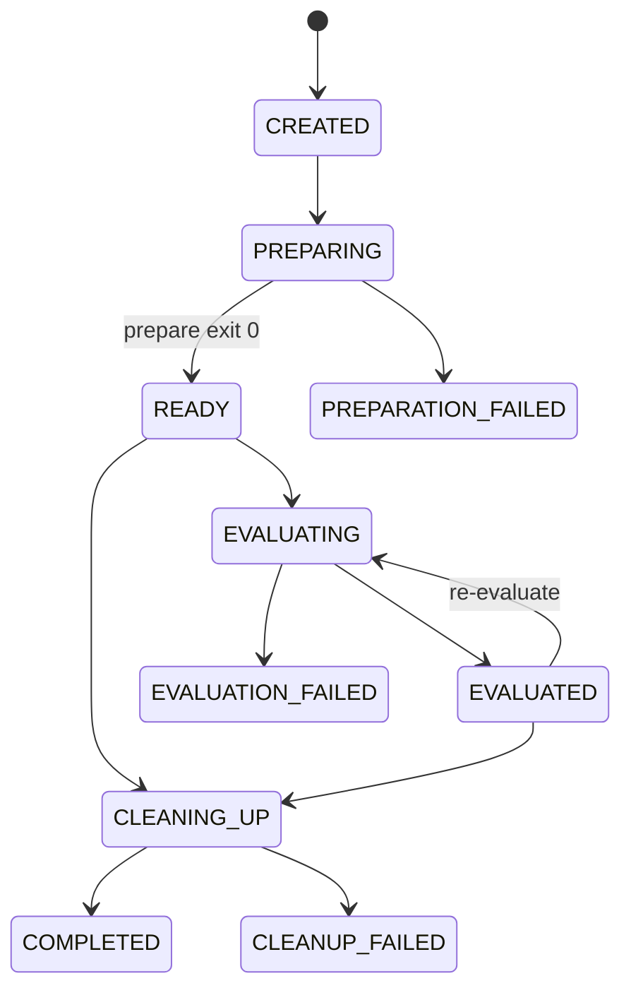

# Reference Architecture Note: CK-X Simulator

| | |
|---|---|
| **Repository** | https://github.com/sailor-sh/CK-X |
| **Audited commit** | `76a78943556af64a774a1c22b283efc22906ff1c` (HEAD, 2026-09-18; 91 commits since 2025-04-02) |
| **Audit date** | 2026-09-26 |
| **License** | **BSL 1.1** at HEAD. Licensor is Sailor.sh, the Change License is AGPL-3.0, and there is an Additional Use Grant. It was **MIT** from the initial commit `d8b69865f6bee53480c2fa030036feee7fe6c595` until `b83738716cded489c0fac0bb1e90f97f3dcbaca7` (2026-05-09). The last MIT revision is `199f4be4f4b5b383121ad58b003c18482e3e1fce`. |
| **Method** | Static code reading; nothing executed (no build, no docker/compose, no provisioning). |
| **KOPS status** | **Architecture reference only.** No code, scripts or task text are reused. |

**TL;DR.** CK-X is a self-hosted, browser-based Kubernetes exam simulator for humans. It runs as a docker-compose stack of eight services. **The cluster is k3d/k3s, not kind.** The `kind-cluster/` directory builds a privileged `docker:dind` image that installs k3d v5.8.3 and creates an unpinned k3s cluster with 1 server and 1–2 agents.

- **Orchestration.** A Node.js *facilitator* does all orchestration by running SSH commands on a *jumphost*. The jumphost creates the cluster, downloads the lab's scripts, runs per-question setup scripts, and later runs per-step validation scripts.
- **Grading.** Exit code 0 means pass. Each step earns its full integer weight or nothing. The score is the passed weight divided by the total weight.
- **Content.** There are 7 labs with 111 questions and 329 graded steps: CKA 30, CKAD 41, CKS 12, Docker 16, Helm 12.
- **What KOPS can learn.** The step-level exit-code grader, the declarative task manifest, setup-manifest fault injection and the async state machine.
- **What KOPS must avoid.** Setup failures are swallowed. Nothing has a timeout. Many "effect" checks only read the spec. Graders can be read from the agent's own host. There is no node access. Nothing is pinned. Telemetry is on by default. There is no CI or content self-test.

---

## 1. Architecture overview

**Containers** (`docker-compose.yaml`; all on bridge network `ckx-network`):

| Service | Image base / role | Notes |
|---|---|---|
| `nginx` | reverse proxy | The **only** published port is `30080:80`. It routes `/` to webapp, `/facilitator/api/` to facilitator, and `/websockify` to remote-desktop (`nginx/*.conf`). |
| `webapp` | Express, socket.io, xterm (`app/`) | Serves the UI and proxies a web SSH terminal to `remote-terminal`. |
| `remote-terminal` | Alpine sshd | Password-authenticated `candidate` user (`remote-terminal/Dockerfile`). |
| `remote-desktop` | XFCE + noVNC, VSCodium | Includes `agent.py` on :5000 with `/restart-vnc-session` and `/clipboard-paste` endpoints. `kubectl` is aliased to an error message (`remote-desktop/startup.sh`). |
| `jumphost` | Ubuntu 22.04, privileged; kubectl, helm, dockerd | Hostname `ckad9999`. This is **where the user works and where setup and validation run** (`jumphost/Dockerfile`). |
| `k8s-api-server` (container `kind-cluster`) | `docker:dind`, privileged | Runs k3d v5.8.3, which creates the k3s node containers (`kind-cluster/Dockerfile`, `kind-cluster/entrypoint.sh`). |
| `facilitator` | Node 18 / Express (`facilitator/src`) | Exam API and orchestrator. |
| `redis` | redis:alpine | Holds exam info, status and results. |

The kubeconfig is shared between jumphost and cluster container through the named volume `kube-config`, at `/home/candidate/.kube/kubeconfig`. Its `server:` is rewritten to `https://k8s-api-server:6443` (`kind-cluster/scripts/env-setup`).



**Facilitator sequence** (`facilitator/src/services/examService.js`, `facilitator/src/services/jumphostService.js`):

```mermaid
sequenceDiagram
  participant UI
  participant F as facilitator
  participant J as jumphost
  participant K as k8s-api-server (DinD)
  UI->>F: POST /api/v1/exams (lab object incl. assetPath)
  F->>F: read config.json; status=CREATED; current-exam-id=uuid
  F-->>UI: 201 {id}
  F->>J: ssh prepare-exam-env <workerNodes> <uuid> (async)
  J->>K: ssh env-setup N cluster (k3d create)
  J->>F: GET assets.tar.gz; untar to /tmp/exam-assets
  J->>J: wait for API; run all q*_setup.sh (exit codes ignored)
  F->>F: status=READY if prepare exit 0
  UI->>F: poll /status; GET /questions
  UI->>F: POST /evaluate
  loop every question, every verification step
    F->>J: ssh export KUBECONFIG=...; validation/<file>.sh
  end
  F->>F: persist result; status=EVALUATED
  UI->>F: GET /result (optional re-evaluate)
  UI->>F: POST /terminate
  F->>J: ssh cleanup-exam-env (k3d delete, prune, rm -rf)
  F->>F: delete redis keys
```

## 2. Runtime lifecycle

1. **Catalog.** `GET /api/v1/assements` (the typo is in the route) returns `labs.json.labs` (`facilitator/src/controllers/assessmentController.js`).
2. **Create.**
   - The UI POSTs the whole catalog entry, including `assetPath` (`app/public/js/index.js`, around line 493).
   - `createExam` returns 409 if the Redis key `current-exam-id` exists. Only one exam can be active per stack.
   - Otherwise it reads `<assetPath>/config.json` from the client-supplied path. Request validation is a placeholder (`facilitator/src/middleware/validators.js`).
   - It stores the info and starts setup without awaiting it (`examService.js:19-60`).
3. **Prepare** (`jumphostService.js:28-99` → `jumphost/scripts/prepare-exam-env.sh`):
   - restart VNC
   - `ssh k8s-api-server env-setup N cluster`
   - download and extract the lab tarball to `/tmp/exam-assets`. The tarball is created at facilitator start by `facilitator/entrypoint.sh`, which tars `scripts/` and deletes the plain directory.
   - poll `kubectl get nodes`
   - `for script in .../setup/q*_setup.sh; do $script; done` (line 73). This loop has no error check, and the script ends with `exit 0`.
4. **Work.** The UI polls `/status` and loads `/questions`. The user opens a terminal to `remote-terminal` and must SSH to `ckad9999` to reach kubectl. The timer exists only on the client (`app/public/js/components/timer-service.js`).
5. **Evaluate** (`jumphostService.js:193-352`). Each step runs sequentially over a fresh SSH connection. The result is written to Redis.
6. **Results / re-evaluate.** `GET /result` returns per-step `{id, description, validAnswer, weightage, score}` plus totals and rank. Re-evaluation reruns all validators against the current state (`app/public/js/results.js`).
7. **Terminate.** Cleanup runs over SSH and the Redis keys are deleted. A cleanup failure is logged, and the exam is still ended (`examService.js:394-435`).

**Redis state machine.** Keys are `exam:info:<id>`, `exam:status:<id>`, `exam:result:<id>` and `current-exam-id` (`facilitator/src/utils/redisClient.js:10-15`).



Because setup errors are swallowed, `READY` does **not** mean "scenario correctly initialized". TTLs are passed as `3600000` to `setEx`, which takes seconds, so keys live about 41 days rather than the commented 1 hour (`redisClient.js:58,79,99,120`).

## 3. Scenario/task representation

Discovery is not automatic. A lab exists only if it is listed in `facilitator/assets/exams/labs.json`, and its `assetPath` points at `facilitator/assets/exams/<category>/<nnn>/`.

| File | Fields (actual) |
|---|---|
| `labs.json` → `labs[]` | `id, assetPath, name, category, description, warmUpTimeInSeconds, difficulty, examDurationInMinutes` |
| `config.json` | `lab, workerNodes, answers, questions, totalMarks, lowScore, mediumScore, highScore` |
| `assessment.json` | `questions[]: {id, namespace, machineHostname, question, concepts[], verification[]}` |
| `verification[]` | `{id, description, verificationScriptFile, expectedOutput, weightage}` |
| `scripts/setup/qN_setup.sh` | one per question, but not always present (ckad-001 has none for Q13 or Q15) |
| `scripts/validation/qN_sM_*.sh` | one per verification step |
| `answers.md` | human-readable reference solution. `cka/002/answers.sh` is the only executable one. |

Fields that exist but are never used:
- `expectedOutput` is `"0"` in all 329 steps and is never read. Only `exitCode === 0` matters (`jumphostService.js:236`).
- `totalMarks`, `lowScore`, `mediumScore` and `highScore` are not referenced in `facilitator/src` or `app/public/js`. The rank cut-offs of 80/60 are hardcoded (`jumphostService.js:291-300`).
- `machineHostname` is `ckad9999` in all 111 questions and is used only for display (`app/public/js/components/question-service.js:80`).

**Trimmed structural example.** The shape follows `cka/002/assessment.json` Q20. Values are placeholders.

```json
{
  "questions": [{
    "id": "<n>",
    "namespace": "<ns>",
    "machineHostname": "ckad9999",
    "question": "<markdown task text>",
    "concepts": ["<tag>", "<tag>"],
    "verification": [
      {"id": "1", "description": "<check>", "verificationScriptFile": "q<n>_s1_<name>.sh", "expectedOutput": "0", "weightage": 2},
      {"id": "2", "description": "<check>", "verificationScriptFile": "q<n>_s2_<name>.sh", "expectedOutput": "0", "weightage": 2}
    ]
  }]
}
```

The paired setup script for that question applies a deliberately misconfigured Deployment. The validators compare `kubectl ... -o jsonpath` values against the corrected values, and the final step also execs an HTTP request inside the pod.

## 4. Environment abstraction

- **Fixed topology, one knob.** The only per-lab parameter is `workerNodes`, which becomes `agents:` in a generated `k3d.io/v1alpha5 Simple` config with `servers: 1` (`kind-cluster/scripts/env-setup:53-75`). Everything else (namespaces, fixtures, CRDs, Helm repos, files) is imperative shell in setup scripts.
- **Distribution.** The distribution is k3s through k3d v5.8.3. The k3s image is **not pinned**, so it is k3d's built-in default. `ENV KIND_DEFAULT_VERSION=v1.32.3` is dead (`kind-cluster/Dockerfile`). The jumphost `kubectl` is whatever `stable.txt` was at image build time, and Helm comes from its `main` install script (`jumphost/Dockerfile`).
- **Cluster defaults.** k3s defaults apply: flannel, the embedded NetworkPolicy controller, `local-path` storage, and Traefik, which is not disabled. Setups add StorageClasses using `rancher.io/local-path`. The Gateway API task pulls CRDs from GitHub at setup time (`cka/002/scripts/setup/q13_setup.sh`).
- **Nesting.** The layers are host Docker → privileged DinD → k3d node containers. The jumphost runs a separate privileged `dockerd` for Docker-topic tasks.
- **Execution point.** Setup, validation and the user all share the jumphost. SSH as `candidate` resolves to UID 0, because `/etc/passwd` is rewritten with a UID-0 `candidate` entry first (`jumphost/Dockerfile:60-67`).
- **No node access.** The lab-authoring guide says node SSH is not provided (`docs/how-to-add-new-labs.md`, "Considerations"). Node concepts are reachable only through the API (taints, affinity by k3d node name) or through pods (hostPath). The static-pod task writes a manifest on the jumphost, where no kubelet runs.
- **Single cluster.** There is one cluster (`CLUSTER_NAME=cluster`) and no multi-cluster or context switching.

## 5. Verification model

**Contract** (`jumphostService.js:219-283`, `facilitator/src/services/sshService.js`):
- **Invocation.** Run `export KUBECONFIG=/home/candidate/.kube/kubeconfig && /tmp/exam-assets/scripts/validation/<file>` over SSH on the jumphost, with no arguments.
- **Outcome.** Exit 0 is pass, and anything else is fail. An SSH or exec exception is also a fail, scored 0. There is **no error/invalid state**, so a grader or infrastructure fault is indistinguishable from a wrong answer.
- **stdout/stderr.** Logged only (human-readable ✅/❌ lines) and never parsed.
- **Weights.** Integer `weightage` of 1–6 per step, parsed with `parseInt` (one weight is a string). A step is all-or-nothing. Partial credit exists only across steps. The score is `round(100 * Σpassed / Σall)`.
- **Ordering.** Strictly sequential, with one SSH connection per step.

**Timeouts.** There are none at the exec level. The only limit is ssh2's 30 s `readyTimeout` for connection setup (`sshService.js`). A hanging `kubectl exec` or `wait` stalls the whole evaluation.

**What is checked.**
- **End-state only.** No shell history or audit log is consulted. The dominant pattern is `kubectl get ... -o jsonpath` plus string comparison.
- **Behavioral checks are rare.** About 21 of 395 scripts exec, run, curl, wget or nc. `kubectl auth can-i` appears in 2.
- **Jumphost file artifacts** (`/tmp/exam/...`) are checked in about 26 scripts.
- **Spec-only "effect" checks.** For example, `cka/001/scripts/validation/q6_s2_validate_network_policy_effect.sh` re-reads the policy's selector, types and port and sends no traffic.
- **The static-pod check** greps a YAML file (`cka/001/scripts/validation/q2_s*.sh`).

**Determinism hazards** (all observed in code):
- Setup failures are swallowed.
- Time-dependent assertions: "no restart in the last 60 s" and `restartCount == 0` at evaluation time.
- Internet dependencies: Bitnami charts, GitHub CRDs and a deprecated `gcr.io` test image.
- Unpinned images (`:latest` or untagged).
- One task depends on inducing eviction pressure.
- One Docker task needs `systemctl` inside a container without systemd.
- Validator files are missing for docker-001 Q15 and Q16, so 5 steps always fail with exit 127.
- Setups run in lexicographic order on one shared cluster. The authoring guide says they run "simultaneously", but the code runs them sequentially.
- The cks-001 setups for removed questions 13–20 still run.

**Grader visibility (leak).**
- `GET /api/v1/exams/:id/questions` returns the full verification array, including descriptions and script filenames, to the browser (`examService.js:215-290`).
- The validators themselves sit in `/tmp/exam-assets/scripts/validation/` on the jumphost, which the user or agent controls as UID 0.
- `answers.md` is served unauthenticated at `GET /api/v1/exams/:id/answers` (`facilitator/src/controllers/examController.js`).
- An agent could read, or even modify, its own grader.

## 6. Reset/cleanup model

- **Whole-environment, per exam.** There is no per-task reset, snapshot or restore.
- **`cleanup-exam-env`** (`jumphost/scripts/cleanup-exam-env.sh`) SSHes to the cluster container and runs `env-cleanup` (`kind-cluster/scripts/env-cleanup`), which:
  - runs `k3d cluster delete` and waits
  - runs `docker volume prune`, `docker network prune` and `docker image prune` (keeping images labelled `ghcr.io/k3d-io`)
  - deletes the k3d config and kubeconfig
  
  The jumphost then runs `docker system prune -a --volumes` and `rm -rf /tmp/exam-env /tmp/exam /tmp/exam-assets`. The facilitator deletes the Redis keys.
- **Leaks across exams.** Jumphost state outside `/tmp` persists. That includes `/etc/docker/daemon.json`, `/etc/kubernetes/manifests/`, `/root/oci-images`, Helm repo config and shell history. The de-facto reset is the next exam's `env-setup` building a new cluster. Warm-up is declared as 120–360 s (`labs.json`).
- **No verification of reset.** No baseline or digest is compared, and a cleanup failure does not block the next exam.

## 7. What is useful for KOPS

These are ideas only, to be re-implemented independently.

1. **Step-level graders with small integer weights**, which give per-criterion diagnostics and partial-credit reporting. KOPS keeps the idea but replaces bare exit codes with typed criteria and a tri-state result.
2. **A declarative task manifest** that separates task text, namespace, setup, verification steps, weights and concept tags. This is close to the split between KOPS `scenario.yaml` and `criteria.yaml` (`docs/scenario-schema.md`).
3. **Fault injection through setup manifests.** Wrong image tags, port or probe mismatches and selector mismatches are cheap, API-only faults. They are good seeds for a `kind`-backend troubleshooting tier.
4. **An async orchestrator with an explicit, persisted state machine** and distinct `*_FAILED` states.
5. **Graders delivered only at run time** (the tarball is fetched at setup). The intent is right. KOPS must also keep graders off the agent's host.
6. **Read-only validators enable re-evaluation**, which is useful for settle-time and stability checks.
7. **An executable reference solution** (`cka/002/answers.sh`). This is the seed of a `kops selftest` oracle run. CK-X never automates it.

## 8. What should NOT be copied

- **Any CK-X task text, setup or validation script, `answers.md` or `answers.sh`.** There are three reasons:
  - The BSL licence (§9).
  - Contamination. The tasks have been public since April 2025 and use common patterns, some closely echoing public community exercise phrasing, so they are unfit as held-out items.
  - Quality defects: 5 missing and 71 orphan validators, spec-only "effect" checks, time-dependent checks, and internet dependencies.
- **Swallowing setup errors** by treating a finished loop as `READY`.
- **Binary pass/fail with no error state**, and **no exec timeouts**.
- **Graders, answers or grader metadata that the agent can see or reach.**
- **Running setup and verification on the same host and identity the agent uses** (UID 0 on a privileged jumphost).
- **Unpinned k3s, kubectl and Helm versions, `:latest` images, and network fetches at setup time.**
- **One shared cluster for all tasks** (cross-task interference) and an unverified reset.
- **Its security posture:** passwordless or fixed-password SSH, privileged containers, an unauthenticated API, and reading a client-supplied `assetPath` from disk.
- **Telemetry on by default.** `facilitator/src/services/metricService.js` POSTs exam events to an external metric server, and `TRACK_METRICS` defaults to `true` (it is also set `true` in `docker-compose.yaml`). **If CK-X is ever run for comparison, set `TRACK_METRICS=false` and block egress.**
- **"Kind" naming for a k3d/k3s environment.** KOPS must state backend and version explicitly.
- **Its marketing claims.** The UI's "real exam" wording (`app/public/index.html:81,211`) is not a model for KOPS.

**Provenance note.** `app/package.json` names the webapp `killer-sh-clone-webapp`. A repo-wide grep found no killer.sh content fingerprints: no `/opt/course`, no planet-named namespaces, no `holy-api`. The evidence points to cloning killer.sh's UI and product concept, not copying its questions. `docs/PRIVACY_POLICY.md` §6 and `docs/CONTRIBUTING.md` claim the questions are original or community-contributed.

## 9. License implications

- **At HEAD (BSL 1.1, `LICENSE`).** The Additional Use Grant allows use, copying, modification and distribution for *personal, educational, research, and non-production* purposes. The restrictions include:
  - no hosted or managed service
  - no commercial production use
  - no monetization
  - no competing SaaS
  - no removal of notices or branding
  - no trademark use

  Derivatives stay under the BSL. Each release converts to AGPL-3.0 four years after it ships. Contributions are BSL (`docs/CONTRIBUTING.md:42`).
- **For a university research benchmark:**
  - Running CK-X locally as a comparison baseline, or citing it, fits "research, non-production".
  - **Incorporating CK-X code or content would make those parts of KOPS BSL-encumbered.** That blocks a permissive OSI release, forbids offering KOPS as a hosted evaluation service, and passes the restrictions on to industry users.
- **MIT-era snapshot.** Revisions up to `199f4be4f4b5b383121ad58b003c18482e3e1fce` were MIT. The exam assets there are nearly identical to HEAD, with only `cks/001/assessment.json` changing afterwards. MIT grants on those revisions are generally understood to be irrevocable. This does **not** change the recommendation, because of the quality and contamination problems, and any reliance on it would need confirmation from the university's legal or tech-transfer office.
- **Recommendation.** Treat CK-X as an architectural reference only. Default to **independent reimplementation with no code reuse**, and cite CK-X as related work.

## 10. Recommended adaptation pattern

This maps CK-X ideas and gaps onto KOPS components (`docs/runtime-architecture.md` §2, `docs/backend-design.md`, `docs/scenario-schema.md`). Everything is reimplemented independently.

| KOPS component | CK-X analogue | Adaptation |
|---|---|---|
| **Scenario Registry** | `labs.json` hand-maintained list | Auto-discover `scenario.yaml`. Lint, including "every referenced criterion or validator exists" and "no orphans" (CK-X has 5 missing and 71 orphans). Compute a content digest and a frozen release manifest. |
| **Scenario Loader** | `createExam` reads `config.json` from a client-supplied path | Registry-resolved IDs only. Render into an `AgentView` (task text plus context) and a hidden `RunnerView`. Criteria names and descriptions never enter the AgentView. |
| **Backend** (`kind` / `kind-node` / `vm`) | k3d-in-DinD, unpinned, no node access | A pinned kind node image and profile per release. `kind-node` for node-file and systemd tasks, and `vm` for kubeadm, etcd and upgrade tasks that CK-X cannot express. Isolation is per trial, never one shared cluster across scenarios. |
| **Setup + setup-confirm** | `q*_setup.sh` loop, errors ignored | Setup runs as verifier-admin from the runner. Any non-zero exit, or a **confirm** negative control that fails (goals must FAIL and guards must PASS right after setup), makes the trial **INVALID**. No network fetches at setup: fixtures and CRDs are vendored and pinned. |
| **Tool Gateway** | user and graders share a UID-0 jumphost | The agent workstation has agent-identity credentials only. Graders, reference solutions and setup assets are never mounted or reachable, and the Gateway is the only path to the environment. |
| **Trace Recorder** | none (logs only) | Record every tool call and the API audit log filtered to the agent identity, plus node journals for `kind-node` and `vm`. |
| **Deterministic Verifier** | bare exit-code scripts, no timeouts | Typed criteria (`k8s.field`, `k8s.can_i`, `net.http`/`net.tcp` positive **and** negative probes, `node.file`, `stability`, …) run from the runner after the agent session is frozen. Each criterion has a timeout and a **tri-state** result: pass, fail or error. **Any `error` makes the trial INVALID**, which is rerun and reported, never counted as FAIL. "Effect" claims require behavioral probes, not spec re-reads. `script` is a justified escape hatch only. |
| **selftest** | `cka/002/answers.sh`, run manually if at all | `kops selftest` per scenario and seed runs, in order: setup-confirm; the **null solution** (must FAIL); optional wrong solutions (must FAIL); the **oracle** run through the Tool Gateway as the agent (must PASS); N-fold determinism; reset digest. It runs in CI. |
| **Result Recorder** | Redis with a mis-set TTL, rank hardcoded | An append-only trial record with per-criterion status, evidence and `failure_class`, the environment fingerprint and the scenario digest. The primary metric is binary PASS (all required criteria pass). Weighted partial credit is diagnostic only. |
| **Reset** | cluster delete + prune; jumphost leaks; unverified | The scenario-declared reset strategy, then a **baseline digest** check against D0. A mismatch quarantines the instance. The workstation is recreated per trial. |

KOPS scope gap that CK-X highlights: CK-X has zero tasks for etcd backup and restore, kubeadm upgrade, kubelet or node repair, control-plane component repair, or certificates, because it has no node access. KOPS needs its `kind-node` and `vm` backends to cover these CKA competencies.

---

## Appendix A. Task inventory

Question counts are the length of `questions[]` in each `assessment.json`. Titles are paraphrased. The access classes are:
- **API**: kubectl only.
- **FS**: jumphost file artifact.
- **DKR**: jumphost Docker daemon.
- **HELM**: helm CLI plus internet.
- **node\***: node concept, reached via the API or a pod only.

| Lab id | Dir | Questions | Verif. steps | Val. files | Setup files | workerNodes |
|---|---|---|---|---|---|---|
| cka-001 | `cka/001` | 10 | 23 | 24 | 10 | 1 |
| cka-002 | `cka/002` | 20 | 59 | 60 | 20 | 2 |
| ckad-001 | `ckad/001` | 21 | 60 | 62 | 19 | 1 |
| ckad-002 | `ckad/002` | 20 | 86 | 104 | 20 | 1 |
| cks-001 | `cks/001` | 12 (20 in `d8b6986`) | 38 | 87 | 21 | 1 |
| docker-001 | `other/001` | 16 | 43 | 38 (5 missing) | 16 | 1 |
| helm-001 | `other/002` | 12 | 20 | 20 | 13 | 1 |
| **Total** | | **111** | **329** | 395 | 119 | |

**cka-001**

| Q | Topic | Access |
|---|---|---|
| 1 | labelled pod in new namespace | API |
| 2 | static-pod manifest (grep only) | FS |
| 3 | StorageClass + PVC | API |
| 4 | two-container logging pod | API |
| 5 | SA/Role/RoleBinding | API |
| 6 | NetworkPolicy (spec-only check) | API |
| 7 | Deployment + NodePort spread | API |
| 8 | requests/limits | API |
| 9 | ConfigMap volume | API |
| 10 | liveness/readiness probes | API |

**cka-002**

| Q | Topic | Access |
|---|---|---|
| 1 | dynamic PVC + pod | API |
| 2 | default StorageClass switch | API |
| 3 | hostPath PV with node affinity | node\* |
| 4 | Deployment + HPA | API |
| 5 | required node affinity | node\* |
| 6 | PSA restricted namespace | API |
| 7 | taint + toleration | node\* |
| 8 | StatefulSet + headless Service | API |
| 9 | DNS test pod | API |
| 10 | DNS tools pod | API |
| 11 | Helm install with values | HELM |
| 12 | Kustomize overlay | FS |
| 13 | Gateway + HTTPRoute (spec only) | API |
| 14 | LimitRange + ResourceQuota | API |
| 15 | resource-consumer monitoring | API |
| 16 | RBAC admin tasks | API |
| 17 | multi-tier NetworkPolicies | API |
| 18 | rolling update, history file, rollback | FS |
| 19 | PriorityClass + anti-affinity + eviction | API (flaky) |
| 20 | fix misconfigured Deployment | API |

**ckad-001**

| Q | Topic | Access |
|---|---|---|
| 1 | Deployment | API |
| 2 | hostPath PV | API |
| 3 | StorageClass WFFC | API |
| 4 | PVC | API |
| 5 | fix bad image tag | API |
| 6 | sidecar shared volume | API |
| 7 | fix Service selector | API |
| 8 | fix CPU limits | API |
| 9 | ConfigMap env | API |
| 10 | Secret-backed DB pod | API |
| 11 | CronJob policy | API |
| 12 | probes | API |
| 13 | ClusterRole/Binding | API |
| 14 | Helm chart install | HELM |
| 15 | CRD | API |
| 16 | NetworkPolicy | API |
| 17 | ClusterIP Service | API |
| 18 | NodePort Service | API |
| 19 | host-based Ingress | API |
| 20 | Job | API |
| 21 | OCI image layout | DKR/FS |

**ckad-002**

| Q | Topic | Access |
|---|---|---|
| 1 | labelled pod | API |
| 2 | sidecar | API |
| 3 | Deployment + Service | API |
| 4 | ConfigMap + Secret | API |
| 5 | probes + limits | API |
| 6 | three Service types | API |
| 7 | PV/PVC | API |
| 8 | CronJob | API |
| 9 | fix Deployment | API |
| 10 | NetworkPolicy | API |
| 11 | securityContext | API |
| 12 | build/run Docker image | DKR/FS |
| 13 | Job backoff | API |
| 14 | init container | API |
| 15 | Helm install | HELM |
| 16 | startup/liveness/readiness | API |
| 17 | lifecycle hooks | API |
| 18 | CRD + CR | API |
| 19 | custom-columns output | FS |
| 20 | env from multiple sources | API |

**cks-001**

| Q | Topic | Access |
|---|---|---|
| 1 | ingress/egress NetworkPolicy | API |
| 2 | TLS Ingress | API |
| 3 | PSS enforce label | API |
| 4 | block metadata egress | API |
| 5 | hostPath binary hashing | node\* |
| 6 | least-privilege Role | API |
| 7 | SA token automount off | API |
| 8 | egress to API server | API |
| 9 | capabilities + read-only root fs | API |
| 10 | RuntimeDefault seccomp | API |
| 11 | baseline PSS | API |
| 12 | Secret volume + env | API |

**docker-001** (all DKR/FS): build/tag, run with ports/env, volumes, multi-stage, daemon cgroup driver, log rotation, custom network, HEALTHCHECK, manifest/platforms, resource limits, compose file, image inspection, fix a container, non-root image, layer optimization (validators missing), content trust (validators missing).

**helm-001** (all HELM/FS): version, repo add, search, install with values, list, status/manifest, upgrade, values file, create, package/index, rollback, debug.

**Topic counts, 83 CKA/CKAD/CKS questions.** Multi-topic questions are counted more than once.

| Topic | Count | Topic | Count |
|---|---|---|---|
| Services, Ingress, Gateway, DNS | 13 | Deployments/rollouts/HPA | 6 |
| Storage (SC, PV, PVC, STS) | 11 | Troubleshooting (injected faults) | 5 |
| NetworkPolicy | 9 | Probes | 5 |
| Pods/multi-container/init/lifecycle | 9 | Helm/Kustomize | 5 |
| Scheduling/quotas/resources | 9 | Jobs/CronJobs | 4 |
| Config (CM, Secret, env) | 7 | CRDs | 2 |
| RBAC/SA | 7 | Docker/OCI | 2 |
| securityContext/PSS/seccomp | 6 | Static pod; kubectl output | 1 each |

Absent: etcd, kubeadm upgrade, kubelet/node repair, control-plane repair, certificates.

## Appendix B. Evidence index

| Claim | Evidence (repo-relative) |
|---|---|
| k3d/k3s, not kind; k3d v5.8.3; unused `KIND_DEFAULT_VERSION` | `kind-cluster/Dockerfile`, `kind-cluster/entrypoint.sh`, `kind-cluster/scripts/env-setup` |
| 1 server + `workerNodes` agents; kubeconfig rewrite | `kind-cluster/scripts/env-setup:53-75`, end of file |
| Compose topology, privileged jumphost/DinD, telemetry env | `docker-compose.yaml` |
| One active exam (409) | `facilitator/src/services/examService.js:22-33` |
| Setup loop ignores exit codes; `exit 0` | `jumphost/scripts/prepare-exam-env.sh:73` and the last line |
| Asset tarball built at start, `scripts/` deleted | `facilitator/entrypoint.sh` |
| Exit-code contract, weights, scoring, hardcoded rank | `facilitator/src/services/jumphostService.js:193-300` |
| No exec timeout (only `readyTimeout`) | `facilitator/src/services/sshService.js` |
| Questions API exposes verification metadata | `facilitator/src/services/examService.js:215-290` |
| Answers served unauthenticated | `facilitator/src/controllers/examController.js` (`getExamAnswers`), `facilitator/src/routes/examRoutes.js` |
| Placeholder request validation | `facilitator/src/middleware/validators.js` |
| Redis keys; TTL units bug | `facilitator/src/utils/redisClient.js:10-15, 58-123` |
| UID-0 `candidate` on jumphost | `jumphost/Dockerfile:60-67` |
| Cleanup chain | `jumphost/scripts/cleanup-exam-env.sh`, `kind-cluster/scripts/env-cleanup` |
| No node SSH; "simultaneous" setup claim | `docs/how-to-add-new-labs.md` |
| Spec-only "effect" check | `facilitator/assets/exams/cka/001/scripts/validation/q6_s2_validate_network_policy_effect.sh` |
| Grep-only static pod | `facilitator/assets/exams/cka/001/scripts/validation/q2_s1_*.sh`, `q2_s2_*.sh` |
| Missing validators (docker-001 Q15/Q16) | `facilitator/assets/exams/other/001/assessment.json` vs `scripts/validation/` |
| CKS trimmed 20→12; orphan setups still run | `git show d8b69865:facilitator/assets/exams/cks/001/assessment.json`; `cks/001/scripts/setup/q13..q20_setup.sh` |
| Telemetry default on | `facilitator/src/services/metricService.js` |
| Client-only timer | `app/public/js/components/timer-service.js` |
| No CI; stale test | `.github/` (templates only); `facilitator/tests/jumphostService.test.js`; `facilitator/package.json` |
| "killer.sh clone" naming | `app/package.json`; `scripts/house-keeping/BUILD-AND-PUSH.md:34` |
| Originality claims | `docs/PRIVACY_POLICY.md` §6; `docs/TERMS_OF_SERVICE.md:18`; `docs/CONTRIBUTING.md:20-21` |
| "Real exam" marketing | `app/public/index.html:81,211`; `README.md:15` |
| License BSL 1.1; MIT history | `LICENSE`; `git log -- LICENSE` (`b8373871…`, parent `199f4be4…`) |
