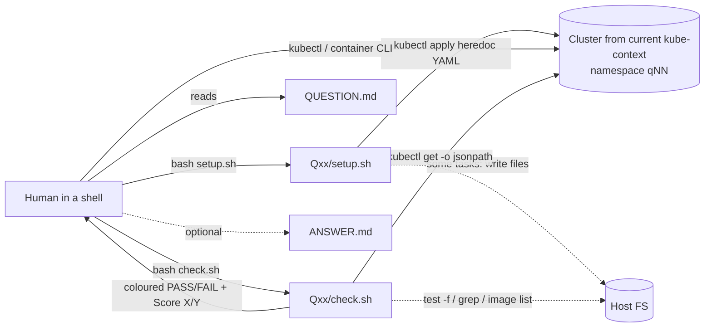

# Reference Architecture Note — ckad-2026

| | |
|---|---|
| **Repository** | https://github.com/tariqm/CKAD-2026 |
| **Audited commit** | `9d66dd80e3fc98e3786fafecab9514ecd1794fd2` (HEAD of `main`, 2026-03-30) |
| **Audit date** | 2026-09-26 |
| **License** | GPL-3.0 (full text in `LICENSE`; the README says "GNU Public 3.0") |
| **Method** | Static code reading and git history inspection. Nothing was executed. |
| **Contamination rating** | **MEDIUM overall.** Q01–Q16 are **HIGH** and QUARANTINED. Q17–Q78 are LOW–MEDIUM. |

**TL;DR.** ckad-2026 is a flat set of **78** independent CKAD practice items (the coordinator's brief said 55). Each item is a folder holding four files: a Markdown statement, an idempotent bash seed script, a bash checker and a Markdown reference answer. There is no orchestrator, no reset, no CI and no machine-readable metadata. Each task runs in its own namespace on whatever cluster the current kubeconfig points at. Checkers award one point per binary criterion by reading `kubectl get -o jsonpath` output, and occasionally host files. The design pattern (one namespace per task; statement, seed, checker and answer kept together) is generic and worth having. The content has a problem. The first 16 items match, in title, order and entities, a simulation in ckad-dojo that is credited to a third-party "practice questions" repository, and that repository's topic cluster is the recall-style "reported real exam" list. Treat the repo as a design reference only. Copy no text, values or code.

---

## 1. Architecture overview

The repo has no framework. It contains 78 sibling directories named `Qxx - <Title>`, plus `README.md`, `LICENSE` and `.gitignore`. Every task directory has exactly `QUESTION.md`, `setup.sh`, `check.sh` and `ANSWER.md`, which I checked by counting: 78 of each and nothing else. The checker helpers are copy-pasted into every `check.sh`. No shared library exists.



## 2. Runtime lifecycle

1. **Select.** The user picks a folder by hand. There is no discovery or listing tool; the README table is the index.
2. **Setup.** `setup.sh` runs under `set -euo pipefail`. It creates namespace `qNN` idempotently, using a client-side dry-run piped into apply. It then applies heredoc manifests and optionally waits on rollout or readiness, sometimes tolerating a timeout. A few tasks write seed files onto the host.
3. **Solve.** The human works directly against the cluster.
4. **Check.** `check.sh` evaluates 2–6 binary criteria and prints PASS/FAIL lines and `Score: X/Y (pct%)`. **The exit status is always 0.** There is no machine-readable result.
5. **Teardown.** None. Running setup again is idempotent only for objects it applies. It does not undo the user's edits.

## 3. Scenario/task representation (structural only)

```
Qxx - <Title>/
  QUESTION.md  H1 "Question N – <title>" · context paragraph · "Your Task" numbered list · "Docs" links
  setup.sh     namespace qNN (idempotent) · heredoc manifests (seed + baked-in fault) · optional wait
  check.sh     [duplicated helper preamble] · header comment "Question N | <title> (K points)"
               · score=0 / total=K · K criteria, each: description + boolean → +1
  ANSWER.md    imperative kubectl steps + YAML fragments
```

- **Metadata:** none machine-readable. Domain, difficulty, weight, prerequisites and tool requirements are all absent. The only link from a task to its points is a comment plus a shell variable.
- **Helper preamble** (names only): a boolean criterion printer, an existence probe, a jsonpath getter and a score printer.
- **Two authoring styles:** Q01–Q16 use one idiom; Q17–Q78 use a "Context:" preamble in the statement and a different error-tolerant idiom in the checker. This fits separate authoring passes and separate origins (§11).

## 4. Environment abstraction

- **Cluster:** whatever the current kubeconfig context points at. The README suggests minikube, kind or a cloud cluster. No provisioning code, version pin or cluster profile is included.
- **Isolation:** one namespace per task (`q01`…`q78`, plus an extra namespace for the cross-namespace NetworkPolicy task). This is the only isolation mechanism.
- **Host coupling:** at least 6 tasks read or write host paths (root's home and `/tmp`) or need a container engine on the machine that runs the checker. One task only works fully if metrics-server exists and accepts a fallback output otherwise. Ingress tasks pass their static checks without an Ingress controller.
- **Images:** mostly floating `:latest` tags (35 occurrences across the setup scripts).
- **Multi-cluster / multi-node / SSH:** none.

## 5. Verification model

- **Granularity:** 2–6 binary criteria per task (tasks worth 2 pts: 9, 3 pts: 27, 4 pts: 30, 5 pts: 10, 6 pts: 2). The 78 tasks total **281** points. Each criterion is worth exactly 1 point, which gives partial credit. There is no pass threshold or exam aggregation.
- **Signals:** object existence; jsonpath equality on spec fields; substring match on multi-valued fields; `status.phase` (10 tasks); available replicas (1); endpoint presence (2); rollout-history inspection (3); host file existence or content and local image presence (≈5).
- **Not used anywhere:** exec, HTTP/TCP probes, logs, SubjectAccessReview / `auth can-i`, stability windows. There are no behavioural checks. NetworkPolicy and Ingress tasks are verified purely on spec or labels.
- **Determinism:** spec checks are deterministic. Status checks are **racy** because nothing polls or settles. One task's check branches on whether a cluster add-on is present.
- **Coverage gaps:** several checkers verify only part of what the statement asks. One RBAC task never checks the binding's subject or roleRef.
- **Internal defects found:**
  - The rename commit left one stale namespace string in a quarantined statement and its answer.
  - In one quarantined task, setup writes a seed file to the current working directory while the statement names a different absolute path.
  - Scoring helpers differ slightly between the two authoring styles.
- **Answer/checker consistency:** never validated. There is no harness that applies `ANSWER.md` and expects full marks.

## 6. Reset/cleanup model

**There is none.** No setup script deletes anything (0 of 78). Resetting is left to the user, presumably by deleting the namespace. The following leak across runs: cluster-scoped objects (a PersistentVolume, a ClusterRole/ClusterRoleBinding), host files under root's home and `/tmp`, and locally built images. A second run of one task can therefore start from a dirty baseline.

## 7. What is useful for KOPS (design ideas only)

1. **A four-part task unit:** statement, seed, checker and reference answer, colocated. This maps directly onto KOPS `task.md`, `setup.sh`, `criteria.yaml` and `reference/solution.sh`.
2. **One namespace per task** as the cheapest isolation layer. It also makes `namespace-delete` reset trivial when a task is purely namespaced.
3. **Idempotent seed creation** (dry-run + apply for namespaces; apply for fixtures).
4. **Faults baked into seed manifests declaratively:** wrong selector or labels, an unresolvable image tag, a container that exits, a quota that forces Pending, an RBAC role missing verbs. Faults are reproducible because they are data, not runtime chaos.
5. **Named, human-readable criteria** with partial-credit visibility. This is useful for diagnostics, even though KOPS's primary metric is all-required PASS.
6. **Breadth of the Q17–Q78 topic list** as a *coverage checklist* against the public curriculum. Use the topics only, not the items.

## 8. What should NOT be copied

- **Any file content:** statements, answers, setup manifests, checker code, helper names or idioms, literal values. The licence is GPL-3.0 and the provenance is unclear.
- **Anything from Q01–Q16:** titles, scenario framing, resource names, literal values, point splits. These are QUARANTINED (§11).
- **Real-exam framing.** The repo name implies a specific exam year, and one quarantined item asserts what "the exam environment" uses.
- **Anti-patterns to avoid:**
  - exit-0 checkers with only coloured-text output;
  - checks on status fields without settle polling;
  - spec-only verification of network behaviour;
  - `:latest` images;
  - no reset;
  - host-path side effects outside a declared workstation;
  - no solution/checker self-test.

## 9. License implications

- **GPL-3.0 is strong copyleft.** Copying or adapting any `setup.sh` or `check.sh` code into KOPS makes that KOPS component a GPL-3.0 derivative on distribution, which forces the licence of the whole combined work. Markdown statements and answers are covered the same way.
- **The licence chain is doubtful.** Q01–Q16 appear to derive, directly or through ckad-dojo's simulation 4, from a third-party repository. ckad-dojo's copy is under CC BY-NC-SA 4.0, and that licence is incompatible with GPL-3.0. If the lineage holds, the GPL grant on those 16 items may not be valid at all. Even full GPL compliance would not give KOPS clean rights.
- **Ideas and architecture are not copyrightable.** KOPS may re-implement the patterns in §7 from scratch and cite this repo in related work.
- **Decision:** reference-only. Zero bytes are imported.

## 10. Recommended adaptation pattern

| KOPS component | Idea taken from ckad-2026 | KOPS improvement |
|---|---|---|
| **Scenario Registry** (lint + contamination scan) | Colocated four-file unit | Require `scenario.yaml` metadata (profile, domain, competency, backend class, provenance). Lint rejects `:latest`, reference files exposed in `task.md`, and missing negative controls. Contamination scan: the fingerprint denylist (§11), plus n-gram and title-sequence similarity against a **quarantine corpus** that holds this repo's Q01–Q16 and ckad-dojo's quarantined paths. |
| **Loader** (seeded parameters) | Fixed names and literals per task | Render `{{params}}` (names, values, ports, label keys) from the trial seed. Static literals make memorised answers work, and seeded variants defeat them. |
| **Backend** | "Current kube-context" | A pinned `kind` profile per Kubernetes version, with a warm pool and an environment fingerprint. A `kind-node`/`vm` class only when node access is truly needed. Never share a cluster across trials without a digest check. |
| **Setup + setup-confirm negative control** | Declarative seed faults | `setup.sh` runs as verifier-admin, then `confirm.must_fail` proves the goal invariant is **false** before the agent starts. ckad-2026 would have caught its broken seed-path task this way. |
| **Tool Gateway** | Human shell with unrestricted host access | The only agent→environment path. It records every action and enforces the declared interfaces. Host or workstation files live only in a declared workstation container. |
| **Deterministic Verifier** | One point per binary jsonpath check | Typed criteria (`k8s.field`, `k8s.rollout_complete`, `k8s.endpoints`, `k8s.can_i` allow **and** deny, `net.http`/`net.tcp` positive **and** negative probes, `stability`), with settle windows. Tri-state `pass/fail/error`. Output is **structured JSON** per criterion (`id, type, required, status, evidence`) with a non-zero exit on error. No text scraping, no keyword heuristics, no positional matching. |
| **selftest** | *(absent)* | For every scenario and sampled seed: the reference solution must PASS, the null solution (do nothing) must FAIL, and each `negative_solutions` entry must FAIL. This would have caught the partial checkers noted in §5. |
| **Reset** | *(absent)*; namespace-per-task is a start | Stamp every object setup creates with ownership labels (`kops.io/scenario`, `kops.io/trial`). Reset by owner label, never by name pattern, including cluster-scoped kinds. Then compare against baseline digest D0. On a mismatch, quarantine the instance. |

## 11. Provenance and contamination evidence

**Origin statements:** none. The README gives usage and exam tips only, with no source, attribution or "inspired by" statement.

**Git history (all commits, full SHAs):**

| Date | SHA | Summary |
|---|---|---|
| 2026-03-27 | `58fb348dde4860ab7a96519dfca3e888a110c74e` | Initial commit (LICENSE only) |
| 2026-03-27 | `87af934e84e703a08ade9e846257ff6904285a7f` | Bulk import of all 78 tasks ("Making rep public") |
| 2026-03-27 | `5e4781e6b60810fe2d03494ef869d1a66c7fcf5a` | README licence note |
| 2026-03-28 | `72c9c17ce48f473eea79d62bece1201a5f816d59` | Checker numbering fixes (42 files) |
| 2026-03-30 | `9d66dd80e3fc98e3786fafecab9514ecd1794fd2` | Namespace references renamed in statements and answers for Q01–Q16 only (28 files) |

One author made all five commits within four days. There is no incremental authoring history.

**Lineage evidence for Q01–Q16:**
1. The 16 titles are **identical and in the same order** as ckad-dojo `exams/ckad-simulation4/questions.md` Q1–Q16. That simulation's header credits a third-party "CKAD-Practice-Questions" repository. Resource names and literal values also coincide item by item. I verified this, but the values are not reproduced here.
2. ckad-dojo added that simulation on 2025-12-19 (`c5b0645c784c9ca4d9c8cd42eb997305baefc0b0`), **before** ckad-2026's bulk import (2026-03-27).
3. The rename commit `9d66dd8…` shows that Q01–Q16 originally used scenario-style namespaces rather than `qNN`. One stale pre-rename string survives.
4. The Q01–Q16 checker idiom and header format match ckad-dojo's older scoring style.
5. The same topic cluster appears again in ckad-dojo simulation 10. Its commit `08ac0e30fbe799b27a83816a74e54c2f60e88262` describes the set as based on exam topics "reported by candidates". That makes this a **recall-derived** cluster.
6. Naming: the repository targets a specific exam year, and one Q01–Q16 item asserts facts about the live exam environment.

**Q17–Q78:** generic curriculum exercises in a different authoring style, with no recall markers. Provenance is undocumented, so they are rated LOW–MEDIUM.

**KOPS quarantine rules derived from this audit:**
- **Quarantined paths:** `Q01 - *` through `Q16 - *` (all four files each). They go into the quarantine corpus for similarity scanning only and are never shown to KOPS authors as templates.
- **Quarantined commits:** `87af934e84e703a08ade9e846257ff6904285a7f` (import) and `9d66dd80e3fc98e3786fafecab9514ecd1794fd2`, whose diff exposes the pre-rename scenario namespaces.
- **Whole repo:** reference-only. Do not vendor, submodule or mirror it.
- **Author rule:** a KOPS scenario covering any of the 16 quarantined topic areas must be authored from the Kubernetes documentation and curriculum only. Its title sequence, resource names and literal values must not match. The registry similarity scan enforces this.

**Fingerprint tokens for the KOPS denylist (tokens only):**
- Code-provenance tokens (scan `setup.sh`, `criteria` and helper sources): `check_criterion`, `resource_exists`, `kget`, `print_score`, `((score++))`.
- Layout tokens (scan the scenario tree): folder regex `^Q[0-9]{2} - `, file quartet `QUESTION.md`+`ANSWER.md`+`check.sh`, and namespace regex `\bq[0-9]{2}\b` when used as a fixture namespace.
- Q01–Q16 resource names are too generic for token matching. Detect them by **n-gram and title-sequence similarity** against the quarantine corpus instead.

---

## Appendix A. Task inventory

Domain codes: **DB** Application Design and Build · **DEP** Application Deployment · **OBS** Application Observability and Maintenance · **ENV** Application Environment, Configuration and Security · **SN** Services and Networking. Domains are the auditor's best guess; the repo has no domain metadata.

**Q01–Q16 — QUARANTINED (generic topic labels only):**

| id | generic topic label | domain |
|---|---|---|
| Q01 | Secret / secretKeyRef — QUARANTINED | ENV |
| Q02 | CronJob fields — QUARANTINED | DB |
| Q03 | RBAC (ServiceAccount, Role, Binding) — QUARANTINED | ENV |
| Q04 | ServiceAccount on Pod — QUARANTINED | ENV |
| Q05 | Container image build/export — QUARANTINED | DB |
| Q06 | Canary rollout — QUARANTINED | DEP |
| Q07 | NetworkPolicy / labels — QUARANTINED | SN |
| Q08 | API deprecation / manifest repair — QUARANTINED | OBS |
| Q09 | Rollout / rollback — QUARANTINED | DEP |
| Q10 | Readiness probe — QUARANTINED | OBS |
| Q11 | SecurityContext — QUARANTINED | ENV |
| Q12 | Service selector — QUARANTINED | SN |
| Q13 | NodePort Service — QUARANTINED | SN |
| Q14 | Ingress — QUARANTINED | SN |
| Q15 | Ingress pathType — QUARANTINED | SN |
| Q16 | Requests/limits vs quota — QUARANTINED | ENV |

**Q17–Q78 (paraphrased titles):**

| id | title | domain | id | title | domain |
|---|---|---|---|---|---|
| Q17 | Sidecar multi-container pod | DB | Q48 | Diagnose image pull failure | OBS |
| Q18 | Pod with init container | DB | Q49 | Capture resource usage to file | OBS |
| Q19 | Job completions and parallelism | DB | Q50 | Pod with all three probes | OBS |
| Q20 | emptyDir shared volume | DB | Q51 | Debug pod with wrong command | OBS |
| Q21 | PersistentVolume and claim | DB | Q52 | Troubleshoot via describe | OBS |
| Q22 | Mount claim in pod | DB | Q53 | Logging sidecar | DB |
| Q23 | Deployment labels and annotations | DEP | Q54 | Secret mounted as volume | ENV |
| Q24 | Override command and args | DB | Q55 | ServiceAccount bound to Role | ENV |
| Q25 | Multi-container log aggregator | DB | Q56 | ClusterRole and binding | ENV |
| Q26 | Job backoffLimit | DB | Q57 | runAsNonRoot | ENV |
| Q27 | CronJob concurrencyPolicy | DB | Q58 | readOnlyRootFilesystem | ENV |
| Q28 | Repair crash-looping pod | OBS | Q59 | fsGroup | ENV |
| Q29 | hostPath volume | DB | Q60 | ResourceQuota | ENV |
| Q30 | Deployment with multiple containers | DB | Q61 | LimitRange | ENV |
| Q31 | Deployment with container port | DEP | Q62 | Projected Secret+ConfigMap volume | ENV |
| Q32 | Temporary debug pod | OBS | Q63 | Default-deny NetworkPolicy | SN |
| Q33 | Pod with requests only | ENV | Q64 | Drop/add capabilities | ENV |
| Q34 | Scale Deployment | DEP | Q65 | ServiceAccount token | ENV |
| Q35 | RollingUpdate strategy | DEP | Q66 | Repair RBAC permission | ENV |
| Q36 | Blue-green switch | DEP | Q67 | Downward API env | ENV |
| Q37 | maxSurge / maxUnavailable | DEP | Q68 | Downward API volume | ENV |
| Q38 | Change-cause annotation | DEP | Q69 | Registry credential Secret | ENV |
| Q39 | Recreate strategy | DEP | Q70 | ClusterIP Service | SN |
| Q40 | Rollout restart | DEP | Q71 | Expose Deployment imperatively | SN |
| Q41 | Env from ConfigMap | ENV | Q72 | Headless Service | SN |
| Q42 | Repair failed rollout | DEP | Q73 | ExternalName Service | SN |
| Q43 | Exec liveness probe | OBS | Q74 | NetworkPolicy allow port | SN |
| Q44 | Startup probe | OBS | Q75 | NetworkPolicy allow namespace | SN |
| Q45 | Debug crash-looping pod | OBS | Q76 | NetworkPolicy egress | SN |
| Q46 | Save pod logs to file | OBS | Q77 | Ingress multiple paths | SN |
| Q47 | Diagnose Pending pod | OBS | Q78 | Ingress with TLS | SN |

Totals (all 78): DB 15 · DEP 12 · OBS 14 · ENV 22 · SN 15.

## Appendix B. Evidence index

| # | Evidence | Location |
|---|---|---|
| E1 | 78 folders, each with exactly 4 files | `find` over repo root; counts 78×{QUESTION.md, setup.sh, check.sh, ANSWER.md} |
| E2 | No CI or tests | no `.github/`, no test files |
| E3 | No reset; setup never deletes | grep `delete` in `*/setup.sh` → 0 files |
| E4 | Always exit 0; text-only score | `*/check.sh` (no `exit` with status; `print_score` output) |
| E5 | Point distribution; total 281 | `total=` in `*/check.sh` |
| E6 | No behavioural checks | grep exec/curl/logs/`auth can-i` in `*/check.sh` → 0 |
| E7 | Racy status checks | `.status.phase` in 10 checkers; available replicas in 1 |
| E8 | Host coupling | root-home and `/tmp` paths in 9 statements; image-list checks |
| E9 | `:latest` images | 35 occurrences in `*/setup.sh` |
| E10 | Two authoring styles | Q01–Q16 vs Q17–Q78 checker header/idiom |
| E11 | Bulk import, one author, 4 days | `git log` (5 commits, §11) |
| E12 | Q01–Q16 namespace rename | `9d66dd80e3fc98e3786fafecab9514ecd1794fd2` diff (28 files) |
| E13 | Title and entity identity with ckad-dojo sim4 Q1–Q16 | ckad-dojo `exams/ckad-simulation4/questions.md` @ `b6686223aa9a7d8df57edefa00cc85d715a22b70` |
| E14 | sim4 precedes ckad-2026 | ckad-dojo `c5b0645c784c9ca4d9c8cd42eb997305baefc0b0` (2025-12-19) vs `87af934…` (2026-03-27) |
| E15 | Same topic cluster described as candidate-reported | ckad-dojo `08ac0e30fbe799b27a83816a74e54c2f60e88262` commit message |
| E16 | No origin statement | `README.md` |
