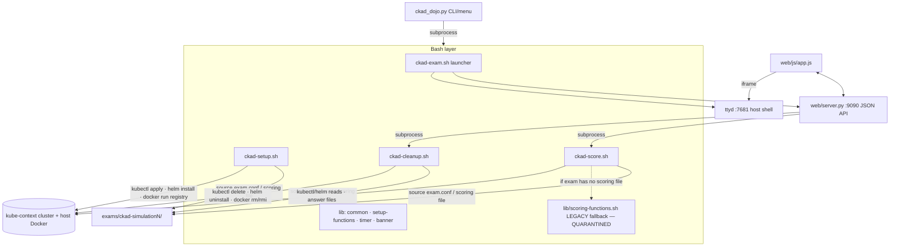

# Reference Architecture Note — ckad-dojo

| | |
|---|---|
| **Repository** | https://github.com/TiPunchLabs/ckad-dojo |
| **Audited commit** | `b6686223aa9a7d8df57edefa00cc85d715a22b70` (HEAD of `main`, 2026-09-24; package version 1.7.0) |
| **Audit date** | 2026-09-26 |
| **License** | CC BY-NC-SA 4.0. The `LICENSE` file is a paraphrase of the licence, not the legal code, and adds a "without explicit written permission" clause. |
| **Method** | Static code reading and git history inspection. Nothing was executed. |
| **Contamination rating** | **HIGH** (repository as a whole, including git history) |

**TL;DR.** ckad-dojo is a local "CKAD exam simulator".
- **Runtime:** a Python CLI and a stdlib web server (timer, question navigation, score modal, embedded ttyd host shell) orchestrate bash scripts. The scripts set up, score and clean up **20 self-contained exam directories** containing **398 questions** against whatever cluster kubeconfig points at, plus a host Docker registry and Helm.
- **Architecture:** several parts are worth studying. Exams are self-contained and declared in a config file that lists the namespaces and releases they own. Faults are injected by a post-setup hook. Scorers are read-only and give weighted partial credit. Every question carries curriculum-domain metadata.
- **Verification:** fragile. Results are scraped from text, pass/fail is decided by keyword heuristics, details are matched to questions by position, status checks have no settle window, and there is no cluster-backed self-test.
- **Cleanup:** name-pattern based and destructive on shared clusters.
- **Provenance:** the decisive problem. Git history contains a verbatim copy of a commercial CKAD simulator's question/answer document. Runnable legacy code derived from it is still at HEAD. One current simulation is explicitly recall-derived, and another is adapted from a recall-style list.

KOPS may use the design ideas only. No content, code or history may be imported.

---

## 1. Architecture overview

Layers:
- **Python CLI** `ckad_dojo.py`: argparse, interactive menu and shell completion. It **delegates everything to bash via subprocess** (ADR-0005).
- **Bash business logic:** `scripts/ckad-{exam,setup,score,cleanup}.sh` plus `scripts/lib/{common,setup-functions,timer,banner,scoring-functions}.sh` (ADR-0002).
- **Web:** `web/server.py`, stdlib `http.server` on localhost:9090 (ADR-0001). It exposes JSON endpoints for exams, questions, config, timer, flags, score, cleanup and solutions, and runs the score and cleanup scripts as subprocesses. `web/js/app.js` is a vanilla single-page app (ADR-0003). ttyd serves a **host shell** on port 7681, embedded in the page.
- **Exam content:** `exams/ckad-simulationN/` (ADR-0004), holding `exam.conf`, `questions.md`, `solutions.md`, `scoring-functions.sh`, `manifests/setup/*.yaml`, `templates/qNN-*` and optionally `post-setup.sh`.
- **Legacy (quarantined):** root-level `manifests/setup/`, `templates/` and `scripts/lib/scoring-functions.sh`. See §11.



## 2. Runtime lifecycle

1. **Discovery.** Any `exams/*/` directory that contains `exam.conf` is an exam, sorted naturally. The Python and bash sides implement this twice.
2. **Start.** Prerequisite checks (kubectl, cluster reachability, helm, docker daemon, ttyd), then conflict detection against the previously active exam (`/tmp/ckad-dojo/active-exam.state`), with an offer to clean up. Then setup, ttyd with a banner, the web server, and a browser opened on the exam and the official docs. The timer is held in server memory (ADR-0006).
3. **Setup** (`ckad-setup.sh`):
   - load config (the file is *sourced* as bash);
   - apply the namespaces manifest;
   - apply every other seed manifest, falling back to forced replace;
   - create answer directories `./exam/course/{1..N,pK}`;
   - copy templates `qNN-name.ext` → `exam/course/N/name.ext`;
   - start a `registry:2` container on host port 5000;
   - add the public bitnami chart repo and install the configured releases;
   - fixed 3 s sleep;
   - post-setup (a shared broken-release fault plus the exam's `exam_post_setup` hook).

   Errors are counted but do not stop setup. A `|| true` means per-manifest errors never reach the count.
4. **Solve** in the ttyd host shell, against the cluster and the answer files.
5. **Score**, at any time (`ckad-score.sh [-e X] [-q N]` or the web score endpoint). It sources the exam scoring file (falling back to the legacy lib), calls each question function in a subshell, and aggregates. The web path has a 60 s timeout for the whole exam.
6. **Cleanup** (`ckad-cleanup.sh` or the UI "Cleanup & Exit" button). See §6.

## 3. Scenario/task representation (structural only)

```
exams/ckad-simulationN/
  exam.conf             sourced bash: identity (name, id, version, dojo branding, optional credit),
                        timing (duration=120, warning, pause/hints flags),
                        scoring (TOTAL_QUESTIONS, PREVIEW_QUESTIONS, TOTAL_POINTS, PASSING_PERCENTAGE=66),
                        EXAM_NAMESPACES=(…), USER_NAMESPACES=(…) optional,
                        HELM_NAMESPACE, HELM_RELEASES=(…), registry host/port/name,
                        path mapping (exam prefix → local prefix), questions/scoring filenames
  questions.md          "## Question N | <Topic>" → 2-col metadata table
                        (Points, CNCF Domain, CNCF Weight, Namespace, Resources, File to create)
                        → "### Task" → "---"
  solutions.md          same headers; commands + YAML
  scoring-functions.sh  one function per question: score_q1..score_qN (+ optional score_preview_qK)
  manifests/setup/      namespaces.yaml + seed objects (static faults live here)
  templates/qNN-*       starter/answer files copied into exam/course/N/
  post-setup.sh         optional; defines exam_post_setup() for imperative faults
```

- **Metadata strengths:** all 398 questions declare a CNCF domain and weight. The repo also keeps a coverage matrix (`docs/simulation-coverage.csv`) against a curriculum reference (`docs/ckad-curriculum.md`, v1.35).
- **Data quality:** `exam.conf` point totals disagree with the README for 4 simulations. One simulation's question titles (Q10–Q20) were copied from another simulation and do not match their bodies. Titles cannot be trusted as identifiers.

## 4. Environment abstraction

- **Cluster:** an existing cluster via the current kubeconfig. There is no provisioning, version pin or `--context` handling. The docs suggest kubeadm, minikube, kind or the author's Vagrant setup.
- **Declared ownership:** `EXAM_NAMESPACES`, `USER_NAMESPACES`, `HELM_NAMESPACE` and `HELM_RELEASES`. This is the only environment abstraction, and it covers namespaced objects only.
- **Host dependencies:** Docker daemon and registry container (insecure `localhost:5000`), Helm with a public chart repo, internet access for images and charts, ttyd, a browser, write access to CWD and `/tmp`. The setup is **not hermetic**.
- **Workstation model:** the ttyd shell *is* the host, so a user or agent has unrestricted host access.
- **Path mapping:** questions reference a local `./exam/course/N/` directory standing in for a simulator-style absolute path. This is a legacy convention (§11).
- **Multi-cluster / SSH / node model:** none. A per-exam table explicitly replaces "different instances" with one cluster. Node-level tasks are scored as command-text files, not by effect.

## 5. Verification model

**Contract (as consumed by `ckad-score.sh` and `web/server.py`), described structurally:**
- The scoring file is sourced after the common library. It must define `score_q1…score_qN` for N = `TOTAL_QUESTIONS`, and optionally `score_preview_qK`.
- Each function must print one line that is exactly `<int>/<int>` (score/max). The first such line wins. If it is missing the question scores 0/0, and a missing function is logged as FAIL.
- Criterion details come in **two dialects**:
  - **Legacy:** a `Question N | …` header, then one line per criterion carrying a pass or fail glyph. The server extracts these glyph lines inside the question block.
  - **Newer:** a single line prefixed `DETAILS:` that holds sentence fragments. The server splits it on ". " and **infers pass/fail from keywords** such as "not found", "incorrect" and "missing". Details lines are assigned to questions **by position**, so one missing function misaligns every later question.
  - One simulation emits neither dialect, so it shows no criterion details.
- The summary rows (`Q<n> <s>/<m> <topic>`) and a `TOTAL SCORE:` line are regex-parsed after ANSI stripping. The web server hardcodes the pass mark at 66% instead of reading the config.
- Scoring is specified and implemented as **read-only**.

**Granularity and aggregation:** 1–8 points per question (mostly 5–6), split across typically 3–6 **weighted** criteria worth 1–3 points each. This gives partial credit. The question total feeds the exam total and a percentage, with pass at ≥66%. Preview questions are displayed but excluded from the total.

**Signals:** object existence; jsonpath equality on spec; `status` fields (ready replicas, succeeded, phase); Helm list/history/status; rollout history; `grep` on answer files (exact Dockerfile lines, saved-manifest presence, command text containing required flags); local image and registry catalog.

**Determinism assessment:**
- Spec checks are deterministic.
- Status checks race controllers because there is no settle or poll.
- The Helm "pending release" fault is created with a 1-second install timeout, so its final state depends on timing.
- Metrics tasks depend on add-ons being present.
- Exact-string file checks reject equivalent correct answers.
- File-presence criteria reward artefacts, not behaviour.
- No network-behaviour probes exist for NetworkPolicy, Service or Ingress tasks.

**Cluster state vs files:** mostly cluster state. File-based criteria are concentrated in 5 simulations (7–12 answer-path references each) and rare elsewhere.

**Tests and CI:** `.github/workflows/ci.yml` runs pre-commit (shellcheck, shfmt, ruff, yamllint, markdownlint, gitleaks, commitizen, actionlint), bash unit tests, pytest (58 tests, coverage floor 30%), pip-audit, gitleaks and a package build. An OpenSSF Scorecard workflow also runs. The scoring tests are **structural only**: the file exists, the syntax is valid, and the config has a question count. **No cluster-backed E2E exists, and nothing checks that the reference solutions score full marks.**

## 6. Reset/cleanup model

`ckad-cleanup.sh` runs these steps in order:
1. Stop the timer.
2. Uninstall every Helm release in the exam namespaces.
3. **Sweep the `default` namespace.** This deletes *all* user pods, deployments, services (except the API service), secrets, configmaps, PVCs and ingresses, whoever created them.
4. Delete the declared exam and user namespaces, without waiting.
5. **Delete PersistentVolumes** whose claim namespace is an exam namespace **or empty**. That means *any unbound PV in the cluster*. It also deletes PVs matching legacy name patterns. Deletion is forced with zero grace.
6. Delete StorageClasses matching name patterns.
7. Delete ClusterRoles/Bindings by a hardcoded name list.
8. Remove the answer directory.
9. Stop the registry.
10. Remove Docker containers and images matching legacy name patterns and the local registry prefix.
11. Reset the timer, then wait for namespace termination.

**Assessment:**
- Namespaced reset driven by the declared namespaces is sound.
- Cluster-scoped and host reset is **pattern-based, not ownership-based**. It can leak objects from newer exams and over-delete unrelated objects.
- Several patterns are fingerprints of the quarantined legacy content.
- Nothing verifies that the cluster has returned to its pre-exam baseline.

## 7. What is useful for KOPS (design ideas only)

1. **Self-contained scenario directories** (ADR-0004), plus a declarative config that lists owned namespaces and releases. This validates KOPS's `scenarios/<id>/` layout with `scenario.yaml`.
2. **Seed manifests plus an imperative post-setup hook.** Static faults are data. Dynamic faults (a failed release, a bad-image rollout, manufactured revision history) are code run after seeding.
3. **A template convention** that places starter files for artefact tasks in a known per-task directory.
4. **Read-only scorers, weighted criteria and per-criterion detail in the UI.** These are good ideas, but they need a typed, structured channel (§10).
5. **Curriculum-domain and weight metadata on every task, plus a coverage matrix.** This mirrors KOPS's `profiles` and competency model.
6. **Active-session state file** used to scope score and reset automatically.
7. **Thin orchestrator over thin tool calls:** a Python UX layer delegating to kubectl, helm and docker. Tool logic stays visible and auditable.
8. **Security hygiene in CI:** pinned action SHAs, gitleaks, pip-audit, Scorecard. This is a reasonable template for KOPS's own CI.
9. **Distinct problem-type catalogue** (Appendix A), useful as a coverage checklist only.

## 8. What should NOT be copied

- **Any content:** questions, solutions, scoring functions, manifests, templates, post-setup scripts, dojo themes and namespace schemes. The licence is CC BY-NC-SA and provenance is compromised.
- **Quarantined material:** root-level legacy files; simulations 4 and 10; the git history (§11).
- **Simulator conventions:** the absolute-path artefact convention and its "original → local" adaptation table, preview questions, and the 120-minute / 66% exam framing. These fingerprint a commercial simulator and distract from KOPS's all-required-invariant semantics.
- **Anti-patterns:**
  - text-scraped results;
  - keyword-inferred pass/fail;
  - positional detail matching;
  - hardcoded pass threshold in the server;
  - status checks without settle;
  - exact-string grading of files;
  - destructive default-namespace sweep;
  - "delete any unbound PV";
  - name-pattern cluster cleanup;
  - agent or user shell on the host;
  - non-hermetic setup (public chart repo, host Docker);
  - `|| true` swallowing setup errors.

## 9. License implications

- **CC BY-NC-SA 4.0 on software.** Creative Commons recommends against CC licences for code.
  - *NonCommercial* forbids commercial use, which could restrict industry partners using or hosting KOPS.
  - *ShareAlike* requires adaptations to carry the same licence, which is **incompatible with GPL, Apache-2.0 and MIT**. Any dojo-derived file would contaminate KOPS's licence.
- **Paraphrased LICENSE file.** The repo's file is not the official legal code and adds a permission clause, so the exact terms are ambiguous.
- **Rights the licensor lacks.** The licensor cannot license content it does not own: the commercial-simulator-derived legacy material and the recall-derived items. For those, even full CC compliance gives no rights.
- **Third-party adapted simulations.** Simulations 6–9 are adapted from an external exercise collection whose own licence was not verified in this audit.
- **Decision:** architecture reference and related-work citation only. Zero bytes are imported.

## 10. Recommended adaptation pattern

| KOPS component | Idea from ckad-dojo | KOPS realisation |
|---|---|---|
| **Scenario Registry** (lint + contamination scan) | Self-contained exam dirs; discovery by config presence; structural CI tests | Discover `scenarios/**/scenario.yaml`. JSON-Schema plus cross-file lint. Content digest. **Contamination scan** of `task.md`, fixtures and verifier sources against the denylist tokens in §11 and against n-gram similarity to the quarantine corpus. `provenance.authored_clean_room: true` is required. |
| **Loader** (seeded parameters) | Fixed themed names per exam | Render names, values, ports and labels from the trial seed. Only the AgentView (the rendered task) crosses to the agent. |
| **Backend** | "Current kube-context" plus host Docker | A pinned `kind` profile per Kubernetes version and a warm pool. Any registry or chart dependency is served from a pinned in-cluster or sidecar mirror, never a public repo at trial time. |
| **Setup + setup-confirm negative control** | Seed manifests plus `exam_post_setup` hook | `setup.sh` runs as verifier-admin with helper functions. Faults are declared in the scenario. **`confirm.must_fail`** proves each goal invariant is false after setup, and `must_pass` proves the preconditions hold. A 1-second-timeout fault like dojo's broken release must be replaced by a deterministic construction, or at least confirmed. A failed confirm makes the trial INVALID, never FAIL. |
| **Tool Gateway** | ttyd host shell | The only agent path to the environment. It runs in a declared workstation container with scoped credentials, and every action is recorded. The agent never gets the host. |
| **Deterministic Verifier** | Read-only, weighted per-question scorers | Typed criteria (`k8s.field/exists/count/condition`, `k8s.rollout_complete`, `k8s.endpoints`, `k8s.can_i` allow **and** deny, `net.http/tcp/dns` positive **and** negative, `helm`-state via API objects, `artifact` with a validator instead of grep, `stability`). Settle windows. Tri-state results. Output is **structured JSON**: one record per criterion (`id, type, required, status, evidence, failure_class`). The verifier exits non-zero on `error`. **Never** text scraping, keyword heuristics or positional matching. Thresholds come from scenario data, not server code. |
| **selftest** | *(absent: structural tests only)* | `kops selftest` for each scenario and sampled seed: reference solution → PASS, null solution → FAIL, each `negative_solutions` entry → FAIL. It runs in CI on a real `kind` backend. |
| **Reset by ownership labels + baseline digest** | Declared namespaces and releases | Every object created by setup, and optionally by the agent via gateway mutation, is labelled `kops.io/scenario` and `kops.io/trial`. Reset deletes by label across namespaced **and cluster-scoped** kinds and never sweeps `default`. Then canonical digest D0 is compared. On a mismatch the instance is quarantined. Name patterns are never used. |

## 11. Provenance and contamination evidence

**A. Verbatim commercial-simulator copy in git history.**
- The file `simulation1.md` was added in the initial commits `5646e61e0b927f42f1d89a2588c2cf2ac4c0308e` and `ce200ed936179f53c98afd0ea1decd25af25ce7b` (both 2025-12-04; two parallel lineages, both reachable from `main`). It was deleted in `2b839f8781a88c3c0db7f5333f2a0fe0cab46100` and `0a02796131f3ff44434463f161a87023d59a67b9` (both 2025-12-09).
- Description only: 3,293 lines, 103,777 bytes.
  - Its first line is a title naming a "CKAD Simulator" and a Kubernetes version, 1.34.
  - It is a question/answer document with 22 numbered questions and 3 preview questions.
  - It contains 28 occurrences of the vendor name, 26 occurrences of simulator host/terminal prompts, and the vendor's interactive-scenario footer link.
- `fd42ecc390e420c4b03306f5f419dafdc8efe272` / `6b7ec28390de26801a4a9c4b5e69e215fbd08c33` (2025-12-06) turned it into the first runnable simulation 1 ("planetary theme", 22 questions, 113 points), and `6116c42b27fdceac718e69472f526b211d6084d4` added the root-level legacy copies.
- That simulation 1 was later untracked by `d8defb0b2fb167608bf618c05395c6e7f5261eae` (2026-01-28) and replaced by new content in `b644ce14bef47707f02864e8906e12a8826e7778` (2026-02-02).
- `.gitignore` still excludes a "local-only exam" glob (`exams/ckad-local*`).

**B. Derived legacy still at HEAD (`b6686223…`).** 27 tracked files contain the fingerprint tokens:
- `manifests/setup/`: 12 files, including a namespaces manifest with 11 planet-named namespaces and a shell-intern namespace.
- `templates/`: 6 entries, including a Go image directory.
- `scripts/lib/scoring-functions.sh`: **22 question functions plus 1 preview**, which map one-to-one onto the simulator's Q1–Q22 namespace and entity layout. It is **still wired as the scoring fallback** in `scripts/ckad-score.sh`.
- Cleanup patterns in `scripts/lib/setup-functions.sh`.
- A setup-detection heuristic in `ckad_dojo.py`.
- `specs/001-ckad-exam-simulator/*`, whose acceptance criteria enumerate the planet namespaces, `specs/002-…`, `specs/016-…`.
- `tests/python/conftest.py`, `tests/python/test_server.py`, `tests/test-setup-functions.sh`.
- The 20 current `exams/*` simulations contain **none** of the planet namespaces or the headline entity token. The words that did match are incidental, not fingerprints.

**C. Self-admitted derivative and recall sources.**
- `specs/017-sim2-original-exam/spec.md`: the earlier simulation 2 was "a copy of simulation1 with different names" (80–95% similarity). It was rewritten in `c5b0645c784c9ca4d9c8cd42eb997305baefc0b0` (2025-12-19), and `specs/015-unique-q1-questions` de-duplicated the simulator-style Q1 across simulations.
- `08ac0e30fbe799b27a83816a74e54c2f60e88262` (2026-03-13), simulation 10: the commit message says the questions are based on exam topics "reported by candidates". This is **recall-derived**.
- Simulation 4: its header and `exam.conf` credit an external "CKAD-Practice-Questions" repository. Its Q1–Q16 are the recall-style cluster.
- Simulations 6–9: adapted from an external CKAD exercise collection. Lower risk; licence unverified.
- Simulations 12–20: declared original. All added by one contributor in `1d8a211edfe41af670999753780c009e0cde9334` (2026-08-24).
- 19 of 20 current `questions.md` files still carry a simulator "original → local" adaptation table.
- README, CHANGELOG and docs never mention the vendor.

**D. Lineage to ckad-2026.** ckad-2026 (`tariqm/CKAD-2026`) Q01–Q16 match simulation 4 Q1–Q16 in title (same order), resource names and literal values. Simulation 4 is older: 2025-12-19 against 2026-03-27. The checker idiom is also shared.

**KOPS quarantine rules derived from this audit:**
- **Quarantined paths @HEAD:** `manifests/`, `templates/`, `scripts/lib/scoring-functions.sh`, `exams/ckad-simulation4/`, `exams/ckad-simulation10/`, `specs/001-ckad-exam-simulator/`, `specs/002-002-ckad-simulation2/`, `specs/016-sim3-q8-update-strategy/`, `specs/017-sim2-original-exam/`.
- **Quarantined history:** every commit from `5646e61e…` / `ce200ed9…` through `b644ce14…`, and in practice the **entire object store**. Never clone into KOPS infrastructure as a submodule, vendor or mirror, and never run it in a KOPS environment.
- **Remaining simulations** (1–3, 5–9, 11–20) are reference-only, with no ingestion. Simulations 1–3 and 5 are post-overhaul content that keeps the simulator's format lineage.
- **Registry gate:** the KOPS scenario lint fails on any denylist hit in `task.md`, fixtures, criteria or helper code. It also flags n-gram or title-sequence similarity above threshold against the quarantine corpus.

**Fingerprint TOKENS for the KOPS contamination denylist (tokens only):**
- Path and layout: `/opt/course`, `exam/course`, `Local Simulator Adaptations`, `SSH to different instances`, `score_preview_q`, `DETAILS:`, `check_criterion`.
- Vendor markers: `killer.sh`, `killer-shell-ckad`, `killercoda`, `CKAD Simulator Kubernetes`, `candidate@terminal`.
- Namespace tokens. Match these only in a namespace context (`namespace: <t>`, `-n <t>`, `ns/<t>`), because several are common words: `neptune`, `saturn`, `pluto`, `mercury`, `jupiter`, `venus`, `mars`, `earth`, `moon`, `sun`, `shell-intern`.
- Entity tokens (high specificity): `holy-api`, `pod1-status-command`, `neb-new-job`, `webserver-sat-003`, `api-new-c32`, `pvc-126-reason`, `sun-cipher`, `web-moon`, `jupiter-crew`, `project-23-api`, `internal-issue-report`, `project-plt-6cc`.

---

## Appendix A. Task inventory

**Per simulation** (questions / declared points, from `exam.conf`):
1: 21/112 · 2: 20/106 · 3: 20/107 · **4: 17/91 QUARANTINED** · 5: 20/105 · 6: 20/100 · 7: 20/100 · 8: 20/104 · 9: 20/99 · **10: 20/102 QUARANTINED** · 11: 20/104 · 12: 20/108 · 13: 20/110 · 14: 20/112 · 15: 20/110 · 16: 20/114 · 17: 20/119 · 18: 20/118 · 19: 20/120 · 20: 20/122.

**Total: 398 questions, 2,163 points** (37 of the questions are in quarantined simulations). Declared domains across all 398: ENV 102 · DB 94 · DEP 75 · SN 70 · OBS 57. Deduplication: 358 distinct normalised titles, but titles are unreliable (§3). At the level of problem types there are about 65–75 distinct types. Two simulations were checked by body hash and are not verbatim duplicates, but thematic reuse is heavy.

The legacy root lib (22+1 functions) is not counted and is QUARANTINED.

**Distinct problem types** (paraphrased, aggregated across non-quarantined simulations):
- **Application Design and Build:**
  - image builds (build args/labels, multi-stage, healthcheck, export, push to a local registry);
  - Jobs (completions, parallelism, backoff, deadline, TTL);
  - CronJobs (concurrency, history, starting deadline, timezone, job-from-cronjob);
  - init containers (single, chained, failure);
  - sidecar, adapter and ambassador patterns; shared process namespace;
  - emptyDir (size limit), PV/PVC, hostPath;
  - StatefulSet; DaemonSet; command/args override; lifecycle hooks;
  - scheduling (nodeSelector, nodeName, tolerations, affinity, anti-affinity, topology spread); PriorityClass; QoS class.
- **Application Deployment:**
  - create and scale;
  - RollingUpdate tuning (surge, unavailable, minReadySeconds); Recreate; pause/resume;
  - rollback, including to a specific revision; history;
  - canary by replica split; blue/green Service switch;
  - Helm (repo, values, install/upgrade, template/dry-run, rollback, create chart, repair a stuck release);
  - Kustomize (base/overlay, strategic merge, JSON patch, generators);
  - HPA-managed rollout; PDB.
- **Application Observability and Maintenance:**
  - readiness, liveness (HTTP, TCP, exec) and startup probes;
  - logs (previous, multi-container, filtered to file); events export;
  - metrics (top, raw API);
  - ephemeral debug containers; exec troubleshooting;
  - diagnosing crash loops, image pull failures, Pending, ContainerCreating and OOMKilled;
  - API deprecation repair; API discovery, explain, field selectors;
  - node drain (as a command artefact).
- **Application Environment, Configuration and Security:**
  - ConfigMaps (literal, file, env-file, envFrom, items, immutable, multiline);
  - Secrets (literal, file, binary, stringData, registry, TLS, volume/env);
  - projected volumes; downward API;
  - ServiceAccounts (automount, token Secret, projected token);
  - RBAC (namespaced and cluster, forbidden repair, can-i);
  - SecurityContext (non-root, read-only rootfs, capabilities, fsGroup, SELinux);
  - ResourceQuota; LimitRange; requests/limits;
  - Pod Security admission label; CRD discovery.
- **Services and Networking:**
  - ClusterIP, NodePort, headless, ExternalName;
  - named ports; session affinity; traffic policies; topology hints;
  - EndpointSlice inspection; selector repair;
  - DNS/CoreDNS inspection, SRV lookup; port-forward;
  - NetworkPolicy (default deny, label repair, cross-namespace, ipBlock, egress/DNS, port range, named port, AND/OR selectors, isolation);
  - Ingress (paths, default backend, rewrite, regex, TLS, multi-TLS, annotations, repair).

## Appendix B. Evidence index

| # | Evidence | Location |
|---|---|---|
| E1 | 20 exams; question counts | `exams/*/questions.md` headers; `score_qN` counts in `exams/*/scoring-functions.sh` |
| E2 | Points and pass mark | `exams/*/exam.conf` (TOTAL_POINTS, PASSING_PERCENTAGE) |
| E3 | Config sourced as bash; exam loading | `scripts/lib/common.sh` (`load_exam`) |
| E4 | Setup steps; swallowed errors | `scripts/ckad-setup.sh`; `scripts/lib/setup-functions.sh` (`setup_*`) |
| E5 | Broken-release fault with 1 s timeout; post-setup hook | `scripts/lib/setup-functions.sh` (`setup_post_resources`); `exams/*/post-setup.sh` (14 of 20) |
| E6 | Score aggregation; legacy fallback | `scripts/ckad-score.sh` |
| E7 | Keyword pass/fail; positional DETAILS; 66% hardcoded; 60 s timeout | `web/server.py` (`parse_criteria_from_output`, `run_scoring_script`) |
| E8 | Destructive and pattern-based cleanup | `scripts/lib/setup-functions.sh` (`cleanup_default_namespace`, `cleanup_persistent_volumes`, `cleanup_storage_classes`, `cleanup_cluster_roles`, `cleanup_docker_*`); `scripts/ckad-cleanup.sh` |
| E9 | Host shell via ttyd | `scripts/lib/common.sh` (`start_ttyd`) |
| E10 | CI and tests (structural only) | `.github/workflows/ci.yml`; `tests/*.sh`; `tests/python/*` |
| E11 | ADRs 0001–0006 | `docs/adr/` |
| E12 | Curriculum and coverage matrix | `docs/ckad-curriculum.md`; `docs/simulation-coverage.csv` |
| E13 | Verbatim simulator copy (add/delete) | `simulation1.md` @ `5646e61e…`/`ce200ed9…` → deleted @ `2b839f87…`/`0a027961…` |
| E14 | First runnable planetary sim; legacy copies | `fd42ecc3…`/`6b7ec283…`; `6116c42b…` |
| E15 | Sim 1 untracked and replaced | `d8defb0b…`; `b644ce14…`; `.gitignore` |
| E16 | Legacy fingerprints at HEAD (27 files) | `manifests/setup/`, `templates/`, `scripts/lib/scoring-functions.sh`, `ckad_dojo.py`, `specs/001,002,016`, `tests/…` |
| E17 | Admitted copy-and-rename | `specs/017-sim2-original-exam/spec.md`; `c5b0645c…`; `specs/015-unique-q1-questions/` |
| E18 | Recall-derived sim 10 | commit `08ac0e30…` message |
| E19 | Sim 4 external credit; sims 6–9 credit | `exams/ckad-simulation4/{questions.md,exam.conf}`; README Credits |
| E20 | Title/body mismatch | `exams/ckad-simulation15/questions.md` Q10–Q20 vs bodies and simulation 16 |
| E21 | Lineage to ckad-2026 | ckad-2026 @ `9d66dd80e3fc98e3786fafecab9514ecd1794fd2`, Q01–Q16 vs `exams/ckad-simulation4` Q1–Q16 |
