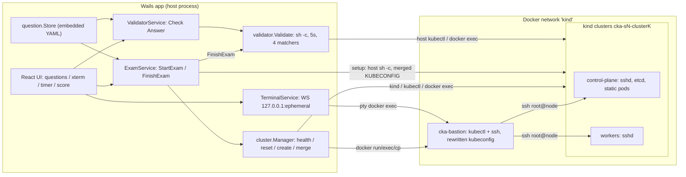

# Reference audit: grindxhq/cka

- **Repository:** https://github.com/grindxhq/cka
- **Audited commit:** `ea74cdb1bd52097ecbc1c31894cf6958532de7e5` (2026-05-02)
- **Audit date:** 2026-09-26
- **License:** Apache-2.0 (`LICENSE`, "Copyright 2026 grindxhq", line 178). There is no NOTICE file.
- **Method:** static code reading; nothing executed. No builds, no clusters, no tests. Statements marked **[static inference]** are conclusions drawn from reading the code and have not been checked at runtime.

**TL;DR.** grindx cka is a Go + Wails desktop simulator for the CKA exam. It has 86 tasks across 5 sessions (18/17/16/19/16) and 359 shell-based checks. Each exam session gets several local kind clusters plus one jump-host ("bastion") container. The bastion has root SSH into every node. Grading runs host-side `sh -c` commands and matches their output (`exact`, `contains`, `regex`, `not-contains`). Each question is pass/fail, and the score is weighted by question.

The most valuable idea for KOPS is `cmd/test-runner`. It is a benchmark self-test: apply each task's reference solution, then run the same validators. As implemented here it has no negative control and bypasses the user's access path. It also duplicates the matcher and is not run in CI.

Other problems found by reading the code:
- Grading runs on the host while the user works in the bastion, which breaks some checks.
- Setup appears to ignore per-task context.
- Several validators are vacuous.
- Reset is an incomplete denylist sweep.

KOPS should reimplement the patterns independently. Only a few non-trivial fragments justify reuse with attribution.

## 1. Architecture overview

Components:
- **Entry/wiring.** `main.go:15-19` embeds `frontend/dist`, `questions/` and `deck/`. `main.go:22-31` builds a `question.Store`, an `exam.State` and a `cluster.Manager`. `app.go:34-51` wires the Wails-bound services: Questions, Exam, Cluster, Validator, Terminal, Docs and History.
- **Content.** `internal/question/loader.go:38-146` discovers `questions/exams/<dir>/exam.yaml` and every other `*.yaml` in that directory. Both directories and files are sorted, so the order is deterministic. The loader also reads an optional `<basename>.md` sidecar into `Guide` (lines 137-141).
- **Environment.** `internal/cluster/kind.go` handles health, create, reset, delete and kubeconfig merge. `internal/cluster/bastion.go` builds the jump host, SSH access and the in-network kubeconfig.
- **Orchestration.** `internal/service/exam.go` provides StartExam and FinishExam.
- **Grading.** `internal/validator/validator.go` holds the pure checker. `internal/service/validator.go` exposes per-question "Check Answer".
- **Terminal.** `internal/service/terminal.go` runs a WebSocket on loopback. `internal/terminal/handler_unix.go` bridges it to a PTY running `docker exec -it cka-bastion bash`.
- **Self-test.** `cmd/test-runner/main.go` is a standalone binary. It duplicates the types and the matcher.
- **Dead code.** `internal/server/server.go` is not imported anywhere.



## 2. Runtime lifecycle

1. **Launch.** The store loads 5 exams and selects the first (`loader.go:90-91`). The manager extends PATH for macOS GUI launches (`kind.go:771-786`).
2. **Prerequisites.** The app checks for docker (`docker info`), kind and kubectl (`kind.go:789-814`). The user picks a session and a mode: Exam, or Practice with hints and solutions (`frontend/src/components/ExamSetup.tsx:417-418`).
3. **StartExam** (`exam.go:72-161`):
   - **Cluster setup** (`SetupClusters`, `kind.go:223-368`):
     1. Health-classify each cluster (`kind.go:165-212`).
     2. Reset healthy clusters in parallel.
     3. Delete unhealthy clusters.
     4. Create missing clusters in parallel with `kind create cluster`, export the kubeconfig and poll readiness for up to 120 s (`kind.go:370-463`).
     5. Merge kubeconfigs (`kind.go:561-602`).
     6. Build the bastion (`bastion.go:18-231`). If that fails, fall back to the control-plane container (`kind.go:356-362`).
   - **Node shells.** `PrepareContainer` writes a `.bashrc` into the nodes (`kind.go:92-120`).
   - **Setup.** Every question's `setup` runs sequentially on the host with `KUBECONFIG=<merged>`. Errors are only warnings, and the context is not switched per question (`exam.go:126-150`).
   - **Timer.** The exam timer starts (`internal/exam/state.go:32-43`).
4. **Solve.** The terminal waits for cluster health, then opens a PTY to the bastion (`handler_unix.go:42-129`). The user runs `kubectl config use-context …` (a copy button is at `frontend/src/components/QuestionPanel.tsx:7-9`) or `ssh <node-container>`.
5. **Check Answer** (Practice mode only). `internal/service/validator.go:29-50` validates one question. A passing result is never downgraded later (`state.go:89-92`).
6. **Finish.** The UI polls every 15 s and finishes automatically on timeout (`frontend/src/hooks/useExam.ts:208-212`, `frontend/src/hooks/useTimer.ts:12`). `FinishExam` re-validates every question, computes `floor(earned*100/total)` and per-category scores, and appends to `~/.grindxhq/cka/history.json` (`exam.go:219-345`, `internal/service/history.go:48-68`).
7. **Reset.** Nothing is reset at finish or shutdown; clusters are left running (`app.go:62-71`). Reset happens on the next StartExam (§6) or through `DeleteAllClusters` (`kind.go:691-707`).

## 3. Scenario/task representation

Schemas:
- **Exam** (`internal/question/models.go:5-22`): `id, name, description, duration(s), difficulty, passScore(%), tags, clusters[{name, controlPlane, workers, nodes}]`. The `nodes` field is not used by the code (`kind.go:240-251`).
- **Question** (`models.go:39-52`): `id, title, category, difficulty, weight, context, task, guide?, setup[], validation[], hint?, solution?`. `setup` and `validation` carry `json:"-"`, so they are never sent to the UI (`models.go:48-49`).
- **ValidationRule** (`models.go:64-69`): `{description, command, expect, match}`.

All 86 files use exactly the keys `id…solution`. None uses `guide`, and no `.md` sidecars exist.

The example below is trimmed from `questions/exams/session-4/s4-03-service-no-endpoints.yaml`:

```yaml
id: "s4-03-service-no-endpoints"     # equals file basename (all 86)
title: "..."
category: "Service & Networking"     # free text; 29 distinct values in bank
difficulty: "hard"
weight: 10
context: "kind-cka-s4-cluster1"      # kubectl context used by validator
task: |
  ...
setup:                               # host shell; fault injection lives here
  - "kubectl create deployment backend --image=nginx -n default"
  - "kubectl expose deployment backend --name=backend-svc --port=80 --target-port=80 -n default"
  - "kubectl patch service backend-svc -n default -p '{...\"app\":\"backnd\"...}'"
  - "sleep 3"
validation:
  - description: "..."
    command: "kubectl get service backend-svc -n default -o jsonpath='{.spec.selector.app}'"
    expect: "backend"
    match: "exact"                   # exact | contains | regex | not-contains
hint: |
  ...
solution: |                          # prose shell; `ssh <node>` ... `exit` = run on node
  ...
```

Fault injection is simply `setup` shell. About 20 tasks start broken: bad image tags, wrong selectors or targetPorts, cordons, CoreDNS scaled to 0, a tight quota, a deny-all NetworkPolicy, a StorageClass mismatch, a privileged pod, and a controller-manager manifest moved away via `docker exec` (s5-10). The per-question listing is in Appendix A.

## 4. Environment abstraction

There is no backend interface. `cluster.Manager` is a concrete struct that shells out to `kind`, `kubectl` and `docker` (`kind.go:23-29`). Several details are hardwired:
- Node container naming (`bastion.go:298-328`) and `kind-<name>` contexts.
- The Docker network `kind` (`bastion.go:23`).
- The bastion image `debian:bookworm-slim` (`kind.go:19-20`).

Kind configs are generated from role counts only. No node `image:` is set, so the Kubernetes version is whatever kind defaults to (`kind.go:416-432`) **[static inference]**. The bastion fetches kubectl from `dl.k8s.io/release/stable.txt` at runtime (`bastion.go:55-57`). Question setups download etcdctl v3.5.12 from GitHub (e.g. `session-3/s3-01-etcd-backup.yaml` setup).

Node access works like this:
- openssh-server is apt-installed in each node at runtime.
- The bastion generates an ed25519 key and gets root login.
- Its SSH config maps container names to IPs (`bastion.go:69-171`).

Kubeconfig server URLs are rewritten from `127.0.0.1:<port>` to `<docker-ip>:6443` (`bastion.go:233-296`).

Questions address nodes directly (`docker exec cka-s3-cluster1-control-plane …`) and hardcode node names (s4-05, s5-11). The test-runner has its own separate cluster code (`cmd/test-runner/main.go:576-653`). That code differs from the app: it has no port mapping, uses `--wait 120s` and uses `~/.kube/config`.

## 5. Verification model

**Execution** (`internal/validator/validator.go`):
- Each command runs via `sh -c` on the **host**, with `KUBECONFIG=<merged>` and a 5 s timeout (lines 14, 67-83).
- A non-zero exit fails the check with `Actual="error: …"` (lines 39-47).
- Otherwise, trimmed combined stdout/stderr is matched (lines 50-61, 85-97). The four matchers are:
  - `exact`, which is also the default for unknown values;
  - `contains`;
  - `regex`, which is unanchored unless the pattern anchors itself;
  - `not-contains`.
- A question passes only if every check passes (lines 34-64). Each question is weighted pass/fail with no partial credit (`exam.go:239-306`).
- Validators inspect end state only (API objects, node files, host files). They never look at command history.
- The bank has 359 checks: 272 exact, 63 contains, 22 regex, 2 not-contains.

**Defects:**
1. **Host/bastion mismatch [static inference].**
   - s5-05, s5-06, s5-09 and s5-15 ask the user to write `/tmp/*.txt`. Their validators test the host's `/tmp` (e.g. `test -f /tmp/node-ips.txt`), but the user's shell is `cka-bastion` (`handler_unix.go:68-75`).
   - s5-16 edits the bastion's `/root/.kube/config`, but the validator reads the host merged kubeconfig.
   - The self-test runs solutions on the host, so it cannot detect either problem.
2. **Vacuous validators.**
   - s5-11 checks only `spec.unschedulable==''` and `Ready=True`. Both are true before any action.
   - s2-15 checks a deployment that setup itself created, plus "no unschedulable nodes". Both are also true at the start.
   - s3-01's "non-empty" check (`stat … | grep Size`) passes for an empty file.
   - `contains` over `-o yaml` (s3-05: `'53'`, `'app: backend'`) can match unrelated fields.
   - s3-09 never checks that the audit policy is wired into the apiserver.
   - s5-14 omits its `restore-test` namespace requirement.
3. **No polling or retries.** There is no `kubectl wait` or eventual-consistency loop. Pod-phase checks (`status.phase == Running`) are timing-dependent, and the only mitigation is `sleep N` in setup. The self-test uses a 30 s timeout while the app uses 5 s (`cmd/test-runner/main.go:98` vs `validator.go:14`), so passing E2E does not prove the app will pass.
4. **Context race / wrong-cluster setup.**
   - The validator runs `kubectl config use-context` against a shared file with no lock (`validator.go:22-32`). It fails loudly on error, which is good, but concurrent or overlapping runs can interleave.
   - Setup never switches context (`exam.go:131-143`). The merged kubeconfig is built from Go map iteration order (`kind.go:579-590`), so its `current-context` is non-deterministic.
   - As a result, plain-`kubectl` setup lines in multi-cluster sessions (s1, s3, s4, s5) likely hit an arbitrary cluster **[static inference]**. The self-test switches context before setup (`cmd/test-runner/main.go:191-197`) and would mask this.
5. **Sticky pass.** Once a question passes, a later failure cannot unset it within a run (`state.go:89-92`).

## 6. Reset/cleanup model

`resetCluster` (`kind.go:472-559`) runs at StartExam on clusters that are already healthy. Every step ignores errors:
1. Delete non-system namespaces with `--wait=false`.
2. Run `delete all --all -n default`.
3. Delete configmaps, secrets, PVCs, ingresses, NetworkPolicies, Roles and RoleBindings in `default`.
4. Delete ClusterRoles and ClusterRoleBindings, but only those carrying the `last-applied-configuration` annotation.
5. Delete all PVs.
6. Remove the `dedicated` taint and 9 hardcoded node labels.
7. `rm -rf` a hardcoded list of node paths (`/backup/*`, `/var/lib/etcd-restored`, several `/tmp/*.txt`, `/etc/kubernetes/audit-policy.yaml`).

Unhealthy clusters are recreated (`kind.go:283-343`). The bastion is always recreated (`bastion.go:26`).

**Gaps [static inference]:**
- Not reverted:
  - CoreDNS ConfigMap and replicas (s3-06, s3-07);
  - `static-web.yaml` (s5-01);
  - the moved controller-manager manifest if s5-10 was left unsolved;
  - CSRs, CRDs, PriorityClasses and StorageClasses;
  - ClusterRoles made with `kubectl create`;
  - cordons;
  - host `/tmp` files and host kubeconfig contexts.
- `--wait=false` namespace deletion can race with setup recreating the same namespace. Because setup errors are only warnings, this is a flakiness source.
- The reset list must be kept in sync with question content by hand.
- Nothing checks that the cluster actually returned to a baseline.

The test-runner never resets. With `--e2e` it deletes and recreates clusters per session (`cmd/test-runner/main.go:149-172, 276-283`).

## 7. What is useful for KOPS

**Self-test runner pattern** (`cmd/test-runner/main.go:90-315`). For each task it switches context, runs setup, runs the parsed reference solution, sleeps, runs the same validators, prints a colored report and exits non-zero on failure. Flags: `--session`, `--question`, `--e2e`, `--keep`, `--dry-run` and `--timeout` (lines 91-98). Makefile targets wrap it. KOPS should adopt it with these improvements:
1. **Negative control.** Run the validators after setup and before the solution; they must fail. This would have caught s5-11 and s2-15.
2. **Run the solution via the agent path.** Execute solutions through the same Tool Gateway and access path the agent uses (bastion/SSH/node exec), not host shortcuts. This would have caught the host/bastion mismatch.
3. **Shared matcher and runner.** Use a single verifier implementation for both self-test and grading, with identical timeouts. Today `matchOutput` is duplicated (`main.go:509-521` vs `validator.go:85-97`), and the timeouts are 30 s vs 5 s.
4. **Reset verification.** After each task, reset and verify the baseline digest. Optionally re-run the validators to confirm they fail again, which proves reset removed the solution's effects.
5. **CI.** The runner is absent from `.github/workflows/ci.yml`, which only runs a frontend build, `go vet` and `wails build`. KOPS should gate merges on self-test.

**Other useful patterns:**
- **Declarative check list with loud context-switch failure** (`validator.go:17-32`).
- **Hidden fields.** `setup` and `validation` are never serialized to the UI (`models.go:48-49`).
- **Structured solution targets.** The `ssh <node>`…`exit` convention shows that solutions need a node target. KOPS should make this structured rather than prose-parsed (`main.go:323-460`).
- **Bastion + SSH-to-nodes on kind.** It gives realistic node access (`bastion.go:18-231`).
- **Health-classified cluster lifecycle** with parallel creation and progress callbacks (`kind.go:223-368`).
- **Weighted pass/fail scoring with a per-category breakdown** (`exam.go:239-306`).

## 8. What should NOT be copied

- Host-side grading of state the user edits elsewhere. Validators must execute where the state lives.
- `kubectl config use-context` on a shared kubeconfig, and setup without explicit per-task `--context`. Merging kubeconfigs in map order.
- Denylist resets coupled to task content (`kind.go:472-559`), with no baseline verification.
- Validators satisfiable by the initial state. `stat | grep Size`-style checks. `contains` over whole YAML dumps. Pod-phase checks without polling.
- Unpinned Kubernetes versions and runtime internet downloads (apt, `stable.txt`, GitHub tarballs) (`bastion.go:49-64, 103-121`).
- Solutions returned by the API in all modes and hidden only by the UI (`internal/service/questions.go:44-59`, `QuestionPanel.tsx:286,387`).
- A sticky pass state (`state.go:89-92`).
- A loopback WebSocket with `CheckOrigin: true` and CORS `*` (`handler_unix.go:19-21`, `internal/service/terminal.go:102-113`).
- Task prose/YAML verbatim. The items are generic CKA drills with no killer.sh or exam-dump markers (no `/opt/course`, no planet namespaces, no "real exam questions" claims). Copying them adds nothing and inherits their defects. The README's "realistic"/"real exam" claims refer to the UI (`README.md:3,14`).

## 9. License implications

The license is Apache-2.0 (`LICENSE`), with no NOTICE file, so §4(d) NOTICE propagation does not apply.

If KOPS copies or adapts code, it must:
- (a) ship the Apache-2.0 text;
- (b) mark modified files prominently;
- (c) retain the copyright and attribution ("Copyright 2026 grindxhq").

The source files have no per-file headers, so record attribution in a `THIRD_PARTY_NOTICES` entry and in headers of the derived files.

Apache-2.0 is compatible with permissive licenses and with GPLv3. It includes a patent grant with a termination clause and grants no trademark rights (§6). Do not use "grindx" branding. "CKA" is a Linux Foundation trademark (`README.md` Disclaimer).

Reimplementing ideas independently (the self-test pattern, the check DSL shape) carries no license obligation. Cite the repository in related work.

## 10. Recommended adaptation pattern

| KOPS component | Idea adopted from grindx cka | KOPS-specific change |
|---|---|---|
| **Scenario Registry** | One file per task with an id equal to the basename, hidden setup/validation, weight and category (`models.go:39-52`) | Controlled vocabulary for CKA/CKAD domain (not free text); a structured `solution[]` with `target`; per-task cluster and context binding |
| **Loader** | Deterministic sorted discovery from an `fs.FS` (`loader.go:38-146`) | Schema validation and a rejection list (unknown `match`, missing target), where this repo silently falls back to `exact` |
| **Backend (kind / kind-node / vm)** | Health-classified lifecycle and parallel create (`kind.go:223-368`); in-network kubeconfig rewrite (`bastion.go:233-296`); bastion with SSH (`bastion.go:18-231`) | A backend interface; pinned node images; prebuilt bastion and node images (no runtime apt/curl); short node aliases; explicit `--context` on every call |
| **Setup + confirm** | Setup as ordered commands (`exam.go:126-150`) | Per-task context pinning; setup failure is fatal; a **confirm** step asserting the injected fault is present; validators must fail (negative control) |
| **Tool Gateway** | Bastion as the single user entry point (`handler_unix.go:68-75`) | The agent's only path; the self-test solution also runs through it |
| **Trace Recorder** | none (the repo records no commands) | Record gateway I/O; the repo shows validators need only end state, so traces are for analysis rather than grading |
| **Deterministic Verifier (typed criteria)** | Command/expect/match list; all-pass aggregation; loud context failure (`validator.go:17-97`) | Typed criteria (`k8s.field`, `k8s.can_i`, `net.http`, `node.file` with an explicit node target) instead of free shell; bounded polling; no shared-kubeconfig mutation |
| **selftest** | `cmd/test-runner` loop and flags (`main.go:90-315`) | Negative control → solution via gateway → positive check → reset → baseline digest check → optional re-fail check; shared verifier; runs in CI |
| **Result Recorder** | Weighted score and per-category breakdown; JSON history (`exam.go:239-345`, `history.go:48-68`) | Per-criterion results, non-sticky state, run metadata (commit, image digests) |
| **Reset with baseline digest** | Awareness that artifacts leak across attempts (comment at `kind.go:544-547`) | Replace the denylist sweep with a baseline snapshot and digest comparison, or cluster recreate |

**Candidate code fragments:**

| Fragment | What it does | Recommendation |
|---|---|---|
| `cmd/test-runner/main.go:323-460` (`parseSolution`, `detectHeredoc`, `buildDockerExec`) | Turns a prose solution with `ssh` blocks and heredocs into node/host commands; dedents heredocs | **Independent reimplementation.** KOPS uses structured `solution[]` with targets, so parsing prose is unnecessary |
| `cmd/test-runner/main.go:90-315` | Self-test driver loop and report | **Independent reimplementation.** The pattern is simple and KOPS's flow (negative control, gateway, reset digest) differs |
| `internal/validator/validator.go:21-97` | Context switch, timeout, 4 matchers | **Independent reimplementation.** It is trivial, and KOPS needs typed criteria |
| `internal/cluster/bastion.go:18-231, 298-328` | Jump host on the kind network, key-based SSH to nodes, SSH config, node-name derivation | **Reuse with attribution is optional.** It is non-trivial and working, but must be adapted for prebuilt images. Reimplementation is also reasonable |
| `internal/cluster/bastion.go:233-296` | Rewrites kubeconfig servers to Docker IPs | **Independent reimplementation.** Small; better done by parsing YAML than by string replacement |
| `internal/cluster/kind.go:165-212, 223-368, 449-463` | Health classification, parallel lifecycle, readiness polling | **Independent reimplementation.** Straightforward pattern |
| `internal/cluster/kind.go:561-602` | Kubeconfig merge | **Independent reimplementation.** Trivial, and must be made deterministic (sorted) |
| `internal/terminal/handler_unix.go:33-132` | WebSocket↔PTY bridge | **Reuse with attribution** only if KOPS adds a human-observer terminal; otherwise not needed |
| `internal/question/loader.go:38-146` | Sorted discovery from `fs.FS` | **Independent reimplementation.** Trivial |

## Appendix A. Task inventory

Titles are paraphrased; source files are `questions/exams/session-N/<id>.yaml`. The **Node** column marks tasks that need node/system access (etcd, kubeadm, kubelet config, certs, static pods, control-plane files). **Domain** abbreviations: CA = Cluster Architecture, Installation & Configuration; W&S = Workloads & Scheduling; S&N = Services & Networking; ST = Storage; TS = Troubleshooting.

Per-session totals:

| Session | Tasks | Weight | Clusters (`exam.yaml`) |
|---|---|---|---|
| session-1 | 18 | 82 | 4 |
| session-2 | 17 | 95 | 1 |
| session-3 | 16 | 104 | 2 |
| session-4 | 19 | 148 | 2 |
| session-5 | 16 | 99 | 2 |

| ID | Paraphrased title | Topic | Node | Domain |
|---|---|---|---|---|
| s1-01 | Namespace with ResourceQuota limits | ResourceQuota | No | W&S |
| s1-02 | Deployment with requests/limits | Resources | No | W&S |
| s1-03 | Multi-container pod | Pod | No | W&S |
| s1-04 | Expose workloads with Services | Service | No | S&N |
| s1-05 | ConfigMap as env vars | ConfigMap | No | W&S |
| s1-06 | Secret mounted as volume | Secret | No | W&S |
| s1-07 | Create PV and bound PVC | PV/PVC | No | ST |
| s1-08 | Schedule via nodeSelector | Scheduling | No | W&S |
| s1-09 | Create DaemonSet | DaemonSet | No | W&S |
| s1-10 | Create Job | Job | No | W&S |
| s1-11 | Create CronJob | CronJob | No | W&S |
| s1-12 | Pod with init container | Init containers | No | W&S |
| s1-13 | Liveness and readiness probes | Probes | No | W&S |
| s1-14 | Scale deployment and roll out | Rollout | No | W&S |
| s1-15 | Basic NetworkPolicy | NetworkPolicy | No | S&N |
| s1-16 | ServiceAccount with Role/RoleBinding | RBAC | No | CA |
| s1-17 | Fix pod with invalid image tag | Pod troubleshooting | No | TS |
| s1-18 | Labels and selectors | Labels | No | W&S |
| s2-01 | Required node affinity | Affinity | No | W&S |
| s2-02 | Preferred node affinity | Affinity | No | W&S |
| s2-03 | Taints and tolerations | Taints | No | W&S |
| s2-04 | Pod anti-affinity for HA | Anti-affinity | No | W&S |
| s2-05 | Create PriorityClass | PriorityClass | No | W&S |
| s2-06 | StatefulSet with persistent storage | StatefulSet | No | ST |
| s2-07 | StorageClass dynamic provisioning | StorageClass | No | ST |
| s2-08 | Expand a PVC | PVC resize | No | ST |
| s2-09 | Role for pod management | RBAC | No | CA |
| s2-10 | ClusterRole for node management | RBAC | No | CA |
| s2-11 | Role access across namespaces | RBAC | No | CA |
| s2-12 | Fix CrashLoopBackOff pod | Pod troubleshooting | No | TS |
| s2-13 | Fix Service selector mismatch | Endpoints | No | TS |
| s2-14 | "NotReady" node (simulated by cordon) | Node status | No | TS |
| s2-15 | Drain/cordon node for maintenance | Node maintenance | No | CA |
| s2-16 | Rolling update strategy | Deployment | No | W&S |
| s2-17 | ResourceQuota enforcement | ResourceQuota | No | W&S |
| s3-01 | etcd snapshot backup | etcd | Yes | CA |
| s3-02 | etcd restore to new data dir | etcd | Yes | CA |
| s3-03 | etcd endpoint health to file | etcd | Yes | CA |
| s3-04 | List etcd namespace keys | etcd | Yes | CA |
| s3-05 | NetworkPolicy with ingress/egress | NetworkPolicy | No | S&N |
| s3-06 | Restore CoreDNS scaled to zero | CoreDNS | No | TS |
| s3-07 | CoreDNS stub domain | CoreDNS | No | S&N |
| s3-08 | PSS restricted namespace labels | PSA | No | CA |
| s3-09 | Write audit policy on control plane | Audit | Yes | CA |
| s3-10 | Fix deployment with bad image | Deployment | No | TS |
| s3-11 | Create Ingress | Ingress | No | S&N |
| s3-12 | Create HPA | HPA | No | W&S |
| s3-13 | Create PodDisruptionBudget | PDB | No | W&S |
| s3-14 | Projected SA token volume | Projected volume | No | ST |
| s3-15 | LimitRange defaults | LimitRange | No | W&S |
| s3-16 | Logging sidecar | Multi-container | No | W&S |
| s4-01 | Fix deployment wrong image | Deployment | No | TS |
| s4-02 | etcd emergency snapshot | etcd | Yes | CA |
| s4-03 | Service selector typo, no endpoints | Endpoints | No | TS |
| s4-04 | Pods pending due to quota | ResourceQuota | No | TS |
| s4-05 | Uncordon cordoned workers | Node scheduling | No | TS |
| s4-06 | Fix ImagePullBackOff | Image | No | TS |
| s4-07 | Allow traffic under deny-all policy | NetworkPolicy | No | S&N |
| s4-08 | Fix PV/PVC StorageClass mismatch | PV/PVC | No | ST |
| s4-09 | RBAC so SA can list pods | RBAC | No | CA |
| s4-10 | Raise too-low memory limit | Resources | No | TS |
| s4-11 | Roll back broken rollout | Rollout | No | W&S |
| s4-12 | Fix Service targetPort | Service ports | No | TS |
| s4-13 | Create missing ConfigMap | ConfigMap | No | TS |
| s4-14 | Secret and consumer pod | Secret | No | W&S |
| s4-15 | Compliant pod in restricted namespace | PSA | No | W&S |
| s4-16 | Add memory limits to deployments | Resources | No | TS |
| s4-17 | Harden privileged pod | securityContext | No | W&S |
| s4-18 | Namespaces with quota/limits/netpol | Multi-tenancy | No | CA |
| s4-19 | Deploy three-tier stack with policies | Full stack | No | S&N |
| s5-01 | Static pod on control plane | Static pods | Yes | CA |
| s5-02 | Save kubeadm ClusterConfiguration | kubeadm | Yes | CA |
| s5-03 | Check certificate expiration | PKI | Yes | CA |
| s5-04 | Approve a CSR | CSR | No (setup uses node) | CA |
| s5-05 | JSONPath output to files | kubectl output | No | CA |
| s5-06 | Custom-columns output to file | kubectl output | No | CA |
| s5-07 | CRD and custom resource | CRD | No | CA |
| s5-08 | Read kubelet clusterDNS/domain | kubelet config | Yes | CA |
| s5-09 | api-resources and versions | API discovery | No | CA |
| s5-10 | Restore controller-manager manifest | Static pods | Yes | TS |
| s5-11 | Cordon, drain, uncordon worker | Node maintenance | No | CA |
| s5-12 | ClusterRole node reader for SA | RBAC | No | CA |
| s5-13 | Extract kube-apiserver flags | apiserver | Yes | CA |
| s5-14 | etcd backup and restore | etcd | Yes | CA |
| s5-15 | Sort/filter events to files | Events | No | TS |
| s5-16 | Create kubeconfig context | kubeconfig | No | CA |

There are 13 node-level tasks. None covers kubeadm upgrade or join, systemd/kubelet repair, container runtime repair, or repointing etcd at restored data. s5-14 explicitly waives the etcd repoint, and s2-14 explicitly says it simulates NotReady with a cordon.

## Appendix B. Evidence index

| Citation | Supports |
|---|---|
| `LICENSE:178` | Copyright line; there is no NOTICE file at the repo root |
| `README.md:3,14`; README "Disclaimer" | Realism claims are about the UI; LF trademark disclaimer |
| `main.go:15-31`; `app.go:34-51, 62-71` | Embedding, wiring, clusters left running on shutdown |
| `internal/question/models.go:5-22, 39-52, 48-49, 64-69` | Exam, question and rule schema; hidden fields |
| `internal/question/loader.go:38-146, 90-91, 137-141` | Discovery, default exam, sidecar |
| `internal/cluster/kind.go:19-29` | Constants, Manager struct |
| `internal/cluster/kind.go:92-120` | Node `.bashrc` preparation |
| `internal/cluster/kind.go:165-212, 223-368, 370-463` | Health, lifecycle, create/wait |
| `internal/cluster/kind.go:416-432` | Kind config (no image pin) |
| `internal/cluster/kind.go:472-559` | Reset sweep |
| `internal/cluster/kind.go:561-602, 579-590` | Kubeconfig merge (map order) |
| `internal/cluster/kind.go:691-707, 771-814` | Delete-all, PATH, prerequisites |
| `internal/cluster/bastion.go:18-231, 23, 26, 49-64, 69-171, 103-121` | Bastion build, runtime installs, SSH |
| `internal/cluster/bastion.go:233-296, 298-328` | Kubeconfig rewrite, node names |
| `internal/service/exam.go:72-161, 126-150` | StartExam; setup without context |
| `internal/service/exam.go:219-345, 239-306` | FinishExam; scoring |
| `internal/service/validator.go:29-50` | Check Answer |
| `internal/service/questions.go:44-59` | Solution returned by API |
| `internal/service/terminal.go:38-72, 102-113` | Loopback WebSocket, CORS |
| `internal/service/history.go:48-68` | History file |
| `internal/exam/state.go:32-43, 89-92` | Timer start, sticky pass |
| `internal/validator/validator.go:14, 17-32, 34-64, 67-83, 85-97` | Timeout, context switch, aggregation, exec, matchers |
| `internal/terminal/handler_unix.go:19-21, 33-132, 42-129, 68-75` | CheckOrigin; PTY bridge; bastion target |
| `internal/server/server.go` | Unused chi server (not imported) |
| `cmd/test-runner/main.go:90-315, 91-98, 149-172, 191-197, 233-234, 276-283` | Self-test loop, flags, e2e lifecycle, context switch, settle sleep |
| `cmd/test-runner/main.go:323-460, 509-521, 576-653` | Solution parser, duplicate matcher, separate cluster code |
| `frontend/src/components/QuestionPanel.tsx:7-9, 229, 286, 387` | Context copy block, practice-only gating |
| `frontend/src/components/ExamSetup.tsx:417-418` | Exam vs Practice mode |
| `frontend/src/hooks/useExam.ts:208-212`; `frontend/src/hooks/useTimer.ts:12` | Auto-finish, 15 s poll |
| `.github/workflows/ci.yml` | CI: frontend build, `go vet`, `wails build` only |
| `Makefile` (test-* targets) | Self-test entry points |
| `questions/exams/session-*/exam.yaml` | Clusters per session, duration 7200, passScore 66 |
| `questions/exams/session-5/s5-05-jsonpath-queries.yaml`, `s5-06`, `s5-09`, `s5-15`, `s5-16` | Host/bastion mismatch |
| `questions/exams/session-5/s5-11-node-maintenance.yaml`; `session-2/s2-15-drain-cordon-node.yaml`; `session-3/s3-01-etcd-backup.yaml` | Vacuous validators |
| `questions/exams/session-5/s5-10-component-status.yaml`; `session-2/s2-14-node-not-ready.yaml` | Node-level fault; cordon-simulated NotReady |
