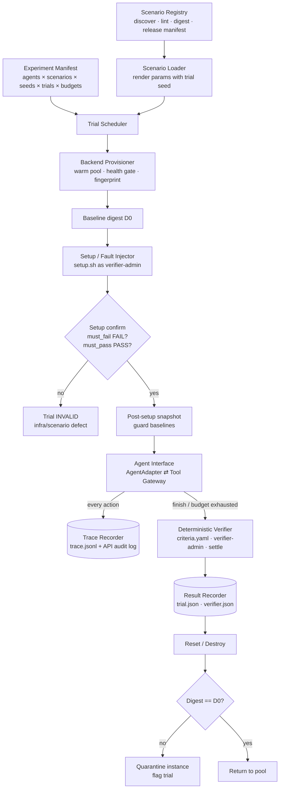

# KOPS Benchmark Runtime Architecture — Proposal (H)

Status: **PROPOSED, not implemented.** This document fixes the *contracts* so the vertical slice can be built against them.

Design goals, in priority order (from the brief):
1. reproducibility
2. experimental control
3. deterministic evaluation
4. model independence
5. clean provenance
6. research interpretability

---

## 1. Lifecycle



**Trial states:**
`SCHEDULED → PROVISIONED → SETUP → CONFIRMED → AGENT_RUNNING → VERIFYING → RECORDED → RESET`

Terminal outcomes: **PASS**, **FAIL**, **INVALID**.

INVALID has these reasons:
- setup error or confirm failure;
- verifier `error`;
- backend health loss not caused by the agent (for example, the host went OOM);
- adapter crash that is not attributable to the model.

INVALID trials are rerun up to a bounded number of times and **reported**. They never count as FAIL.

Budget exhaustion is **FAIL**, with `termination: budget_exhausted`. It is a model outcome, not an infrastructure outcome.

---

## 2. Components

| Component | Responsibility | Key contract |
|---|---|---|
| **Scenario Registry** | Discovers `scenarios/**/scenario.yaml`. Runs lint (scenario-schema.md §5). Computes a **content digest** (sha256 over the canonical tree, including hidden files). Builds release manifests (`benchmark-v1.0.yaml`: list of `(id, revision, digest, status=frozen)`). | A result is valid only if its scenario digest matches the release manifest. |
| **Scenario Loader** | Renders `{{params}}` from the trial seed into a temporary copy. Produces the `AgentView` (rendered `task.md` + `agent_context`) and the hidden `RunnerView`. | Only the `AgentView` ever crosses into the agent interface. |
| **Experiment Manifest** | Declares agents, scenario set (release + filters by profile/domain/class), seed list, trials per (agent, scenario, seed), budgets, and the scaffold/prompt version. | The **unit of reproducibility**. Stored alongside the results. |
| **Trial Scheduler** | Expands the manifest into trials and randomizes execution order (seeded) to avoid time-of-day or pool-warmth confounds. Controls concurrency per backend class. | `trial_id = hash(experiment, agent, scenario@rev, seed, trial_index)` |
| **Backend Provisioner** | Implements the `Backend` interface (backend-design.md §5). Manages the warm pool, health gate and environment fingerprint. | Never hands a dirty instance to a trial. |
| **Setup / Fault Injector** | Runs `setup.sh` with verifier-admin credentials and the helper library (`kops_node_exec`, `kops_apply_fixture`, `kops_wait`). Then runs **setup confirm** (the negative control), then snapshots the guard baselines. | A failed confirm makes the trial INVALID, and the scenario is flagged. |
| **Agent Interface** | `AgentAdapter` plus the **Tool Gateway**, the only path from agent to environment (§3). | The same tools, schemas, budgets and AgentView for every agent. |
| **Trace Recorder** | Appends an event for every observable action (§4). Collects the API audit log filtered to the agent identity, and node journals for kind-node/vm. | No chain-of-thought is requested or stored. Only externally observable data. |
| **Deterministic Verifier** | Runs `criteria.yaml` as verifier-admin from the runner, after the agent's session is closed (the workstation is frozen). Supports settle polling and stability windows. | Tri-state per criterion. PASS iff all required criteria pass. Never LLM-judged. |
| **Result Recorder** | Writes the trial record, criterion results, trace, audit excerpt and environment fingerprint. | Append-only. Results are immutable once written. |
| **Reset / Destroy** | Applies the scenario's reset strategy, then checks the baseline digest. | A mismatch quarantines the instance and annotates the trial. |

### 2.1 Canonical state digest (for reset verification and guard baselines)

The digest is a sha256 over a canonical JSON of these components:

- **API objects.** All namespaced and cluster-scoped objects of the watched kinds, with volatile fields stripped: `resourceVersion`, `uid`, `managedFields`, timestamps, `status`, and events.
- **Node file hashes.** Hashes of declared node paths (for kind-node/vm): `/etc/kubernetes/manifests/*`, `/var/lib/kubelet/config.yaml`, `/etc/containerd/config.toml`, and unit enablement state.

Guards (`k8s.unchanged`, `node.file.unchanged_since`) use the same canonicalization. The volatile-field list is versioned with the verifier.

---

## 3. Agent interface

### 3.1 Two integration modes

| | Option A — runtime-driven loop | Option B — agent-driven loop |
|---|---|---|
| Who owns the loop | The KOPS runner calls `adapter.step(observation) → action` | The adapter owns its own loop (e.g. an existing agent framework) and calls the Tool Gateway (in-process API or MCP endpoint) |
| Experimental control | **Maximal**: same prompt scaffold, loop policy, context-window policy and stop conditions for every model | The scaffold differs per agent, so it confounds model effects |
| Suits | Base SLMs, K8s-specialised SLMs or LoRA adapters, frontier models (via chat APIs) | Third-party agents: kubectl-ai-like CLIs, Claude Code-like agents, custom agent stacks |
| Budget enforcement | Runner | **Gateway**, uniformly in both modes |

**Recommendation: implement both, with a clear methodological split.**

- **Track M (Model comparison)** uses Option A with the KOPS **Reference Scaffold**, a fixed, versioned prompt plus ReAct-style tool loop. This is the track that answers the research question ("what does specialisation add?"), because it holds everything constant except model weights.
- **Track S (Agent systems)** uses Option B. It is reported separately and never mixed into Track M tables.

### 3.2 `AgentAdapter` contract

```python
class AgentAdapter(Protocol):
    def start_task(self, view: AgentView, tools: list[ToolSpec], budgets: Budgets) -> None: ...
    def execute(self, gateway: ToolGateway) -> FinalResponse: ...
    #   Track M: KOPS ReferenceLoopAdapter implements execute() by calling
    #            model.generate(...) → parse tool call → gateway.call(...) until
    #            the model emits `submit` or budgets are exhausted.
    #   Track S: third-party adapter runs its own loop but may ONLY act through gateway.
    def collect_trace(self) -> AdapterTrace: ...
    #   adapter-side observables: model id/revision/quantization, decoding params,
    #   token counts, latency per call, parse errors. Never hidden reasoning.
    def finish(self) -> None: ...     # release model resources; must be idempotent
```

**Model clients behind the Reference Scaffold:**
- An **OpenAI-compatible chat client**. It covers local serving (vLLM, SGLang, llama.cpp, Ollama) for Qwen-class SLMs, merged or unmerged LoRA adapters, and most frontier APIs.
- Native clients where tool-calling semantics differ (e.g. an Anthropic client).

Each run records the model id, weights hash or revision, adapter hash, quantization, serving engine version, decoding params and seed.

### 3.3 Tool Gateway — the single enforcement and recording point

The gateway exposes these tools. The subset available in a trial is the scenario's `interfaces.allowed ∩ experiment policy`.

| Tool | Semantics |
|---|---|
| `run_command(cmd: str, timeout_s?)` | Executes in the workstation shell (bash, non-interactive, no TTY). kubectl, helm, kustomize and ssh are ordinary binaries there, because **exam-realistic CLI use is part of the competency**. |
| `read_file(path)` / `write_file(path, content)` | Workstation filesystem. Replaces interactive editors (vim/nano are unavailable without a TTY). |
| `k8s_api(verb, resource, …)` *(optional)* | Structured API access for agents with no shell (Kubernetes-MCP-style). Uses the same agent identity. |
| `submit(final_response: str)` | Ends the episode. The text is recorded **but has no effect on PASS/FAIL**. |

**Enforcement:**
- Step budget, wall-clock, per-action timeout and output truncation (the truncated output's full-length sha256 is recorded).
- Tool availability, via PATH and the image, not via the prompt.
- Network isolation.

**Uniform presentation.** The observation string format is identical across agents (exit code, stdout/stderr, truncation marker). For SLMs without native function calling, the Reference Scaffold uses a documented text protocol (fenced `action` blocks).

**Interface failures are measured separately.** Malformed tool calls are counted as `interface_errors`, a separate diagnostic from Kubernetes competence. This matters for 2B-class models, where format-following failures could otherwise masquerade as operational incompetence.

### 3.4 What is deliberately *not* allowed

- The agent seeing criteria, invariants, fault descriptions or the reference solution.
- An LLM judging correctness.
- Verifier credentials inside the workstation.
- Internet access.
- Agent-specific tool sets or prompts within Track M.

---

## 4. Trace model (observable only)

`trace.jsonl` holds one event per line:

```json
{"ts":"2026-09-26T14:03:11.412Z","trial_id":"…","seq":17,"type":"tool_call",
 "tool":"run_command","input":{"cmd":"kubectl -n shop-a1b2 get endpointslices"},
 "exit_status":0,"duration_ms":412,"stdout":"…","stderr":"","truncated":false,
 "stdout_sha256":"…","budget":{"steps_used":17,"steps_max":30,"wall_s":211}}
```

**Event types:**
- `trial_start`, `agent_view_presented` (hash of the rendered task)
- `model_call` (adapter side: tokens and latency only)
- `tool_call`, `tool_result`, `interface_error`
- `env_mutation`, derived from the API audit log (verb, resource, name, namespace, user = kops-agent) and from node-file diffs at trial end
- `submit`, `budget_exhausted`
- `verifier_criterion` (id, status, evidence, attempts)
- `trial_end`

The **API audit log** is the authoritative mutation record. The command trace shows *intent*; the audit log shows *effect*.

---

## 5. Results model

```
results/<experiment_id>/
  experiment.yaml                     # frozen manifest (agents, release, seeds, budgets, scaffold version)
  env/<backend-fingerprint>.json      # images, digests, versions
  trials/<trial_id>/
    trial.json        # ids, agent, scenario@rev+digest, seed, outcome, termination, timings, claim
    verifier.json     # per-criterion status/evidence/failure_class, setup-confirm results
    trace.jsonl
    audit.jsonl       # filtered API audit events
    adapter.json      # model/adapter observables
```

**Metrics (per profile, never combined across profiles):**

- **Primary:** scenario pass rate per `(agent, profile)`, reported as pass@1 averaged over trials and seeds, with 95% CIs (bootstrap over scenarios).
- **Reliability:** pass^k, the probability that all k trials pass.
- **Breakdowns:** per domain, per competency, per backend class, per difficulty and per fault category, each with its denominator.
- **Paired model comparison (research question).** Same scenarios, seeds and budgets:
  - McNemar or paired bootstrap on per-scenario outcomes;
  - a mixed-effects logistic regression `pass ~ model + (1|scenario) + (1|family)` as the main inferential analysis.
- **Diagnostics (secondary, labelled as such):**
  - fraction of required criteria met;
  - failure-class distribution;
  - interface-error rate;
  - collateral-damage rate (guard failures);
  - **claim–outcome gap**: the rate at which the agent's `submit` claims success while the verifier says FAIL;
  - steps and time to PASS.
- **Curriculum-weighted profile summary** *(optional, secondary)*: the domain pass rates weighted by curriculum weights, clearly labelled "not a certification score". It is shown only when every domain has non-zero coverage.

---

## 6. Benchmark self-validation (`kops selftest`)

This extends the grindxhq `cmd/test-runner` idea (setup → solution → validate) with the gaps the audit found.

For each scenario (and each sampled seed):

1. **provision**, then compute the baseline digest D0.
2. **setup**, then **confirm**: every `must_fail` goal FAILS (negative control) and every `must_pass` guard PASSES.
3. **null agent**: run the verifier with no agent actions. The result must be FAIL. This is the same as step 2 but executed through the full verifier path.
4. **negative solutions** (optional): for each `reference/wrong-*.sh`, fresh setup, apply, verify. The result must be FAIL (mutation testing of criteria).
5. **reference solution**, run **through the Tool Gateway as the agent identity** (not as admin). Then verify. The result must be PASS.

   This proves the task is solvable with the agent's actual permissions and tools. It closes grindxhq's "solution runs on the host while the user works in the bastion" gap.
6. **determinism**: repeat step 5 N=3 times on fresh instances. PASS in all 3 is required (flake detection).
7. **reset**, then check digest == D0. For `isolation: namespace` this is mandatory evidence.

A scenario reaches `status: validated` only when every step is green. CI runs the self-test for all `kind` scenarios on each change, and for `kind-node` scenarios nightly. `vm` scenarios run on a self-hosted runner.

---

## 7. Proposed repository layout (with changes vs. the brief)

```
kops/
├── README.md
├── LICENSE                      # to be decided (Apache-2.0 recommended; see reuse-register.md)
├── THIRD_PARTY_NOTICES.md       # populated only if code is reused (currently empty by design)
├── docs/                        # this proposal
├── schemas/                     # scenario / criteria / provenance (+ later trace, result, experiment)
├── catalog/                     # CHANGE: competency-model.yaml + problem-family-catalog.yaml (machine-read by runtime)
├── scenarios/
│   └── <scenario-id>/           # CHANGE: flat by id (profile mapping lives in scenario.yaml)
├── runtime/                     # python package `kops`
│   ├── registry/  loader/  scheduler/  runner/
│   ├── gateway/                 # CHANGE: Tool Gateway separated from agent/
│   ├── trace/  verifier/  results/
│   └── selftest/
├── backends/
│   ├── kind/                    # A and B1 (capability flag), cluster profiles, derived node image
│   └── vm/                      # B2 (Incus), image recipes
├── workstation/                 # CHANGE: agent sandbox image (pinned CLIs), one per release
├── agent/
│   ├── interface/               # AgentAdapter protocol, ToolSpec, AgentView
│   └── adapters/                # reference-loop (OpenAI-compatible, native), MCP bridge, third-party
├── experiments/                 # CHANGE: experiment manifests (the reproducible unit)
├── tools/                       # lint, contamination-scan, report generation
├── tests/
│   ├── unit/
│   └── e2e/                     # selftest harness invocations
└── results/                     # git-ignored; archived per experiment
```

**Explanation of the changes:**

1. **`scenarios/<id>/` instead of `scenarios/{cka,ckad}/`.** A dual-profile scenario would otherwise have to live in one folder, which implies a primary certification. The brief forbids that kind of implicit coupling. Per-profile indexes are generated.
2. **`catalog/`.** The competency model and family catalog are runtime inputs (coverage reports, lint), not just documentation. They currently live in `docs/` as the brief requested, and would move once the proposal is accepted.
3. **`runtime/gateway/`.** The gateway is the security and recording boundary. Keeping it apart from `agent/` makes it auditable, and makes it impossible for an adapter to bypass it.
4. **`workstation/`.** The agent's tool environment is an experimental variable. It must be versioned and pinned like the node images.
5. **`experiments/`.** Encodes the controlled comparison (same scenarios, seeds, budgets, scaffold) as data.

**Implementation language:**

| | Option A: Python | Option B: Go |
|---|---|---|
| Model and serving ecosystem (vLLM, HF, OpenAI clients), stats | **Native** | Weak |
| Kubernetes client | Official Python client, or `kubectl` subprocess | Native client-go; kind is a Go library |
| Researcher accessibility (analysis notebooks) | **High** | Lower |
| Single static binary | No | Yes |

**Recommendation: Python** (3.11+, `uv`, pydantic models generated from the JSON Schemas). Backends shell out to the `kind`, `docker`, `incus` and `kubectl` binaries at pinned versions. The research loop sits next to the model ecosystem, and a Go library dependency on kind buys little for this project.
